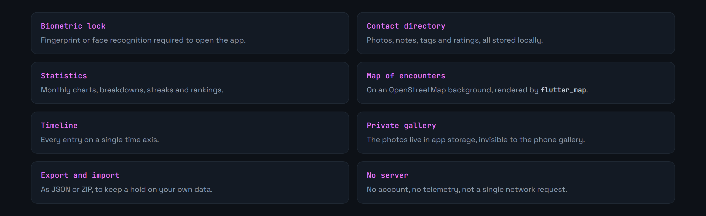
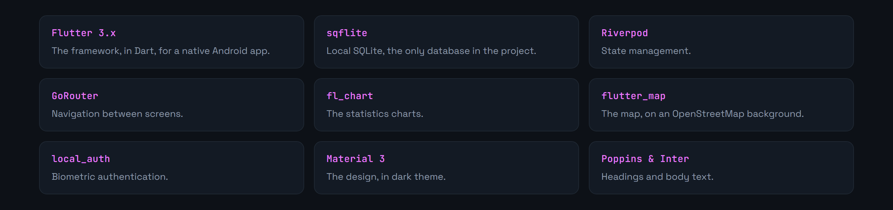
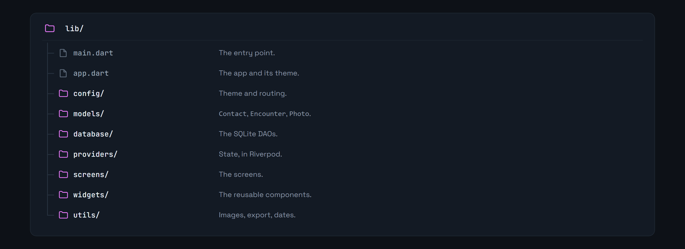

<div align="center">

<p>
  <a href="README.md"></a>
  
</p>


</div>

**An encrypted personal journal, offline, on Android.**

> **Work in progress.** The app runs but is not finished, see the roadmap below.

A personal tracking app that talks to no server. Everything lives in a SQLite database on the phone, behind biometric authentication, and only leaves it if you explicitly ask for an export.

What drew me to the project was the constraint: building something useful on sensitive data **without** a backend, without an account, without telemetry. Every design decision follows from that.










Requires the Flutter 3.x SDK and an Android device or emulator.

```bash
git clone https://github.com/Cybertrist/BodyCount.git
cd BodyCount
flutter pub get
flutter run
```


This is the heart of the project, so it is worth being precise about what is guaranteed and what is not.


The distinction matters. An app that promises privacy and delivers only an interface lock does more harm than an app that promised nothing.


The app records intimate data about real people, who have not consented to appearing in it. The GDPR provides an exemption for strictly personal and household use, but that exemption falls away the moment the data is shared. Use it with judgement, and do not distribute it.

---

<sub>Personal project · Tristan Joncour</sub>
