<div align="center">

<p>
  <a href="README.md"></a>
  
</p>


<br><br>

</div>

I wanted one place to keep what surrounds my encounters: a photo, a few notes about the person, a verdict on the night, tags to remember them by, an address, sometimes what it earned. Highly sensitive information, which has no business in the phone's contacts or in an app that would send it to a server, and which you still want to find in two seconds, neatly sorted, with statistics that make something of it.

Nothing out there did both: keep all of it properly organised, and keep it to yourself. That is where BodyCount comes from. Everything lives in an encrypted database on the phone, behind a fingerprint that does not unlock a screen but the key itself. No server, no account, no telemetry: nothing leaves, except a backup you explicitly ask for, encrypted as well by a passphrase.

Every design decision follows from that constraint, down to the map, which draws France and its 34,836 communes from data shipped inside the app rather than fetching tiles from the internet.


The app is designed first for the passport format, the cover screen of a Galaxy Z Fold: wide and short. That is where it gets used every day, so it carries the full sheet. The faces come from the repository's demo set, generated portraits: nobody real.


On launch, Android puts the icon in the centre; the app picks it up at the same spot, draws a ring around it, raises its name, then slides the logo and title to their exact place on the lock screen. You cannot tell where one ends and the other begins. The fingerprint prompt only comes once the animation is over.

On a regular 16:9 phone, the layout drops to two columns and moves search below the title:

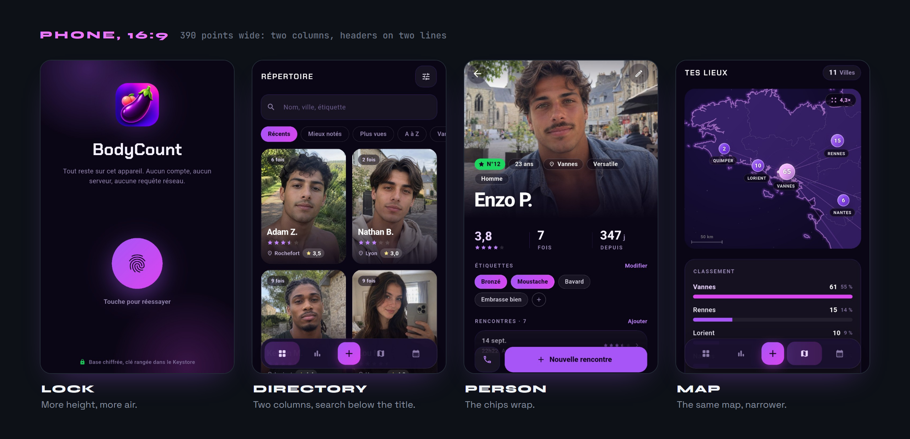

And on the unfolded 4:3 screen, navigation becomes a rail on the left and the directory goes to four columns:

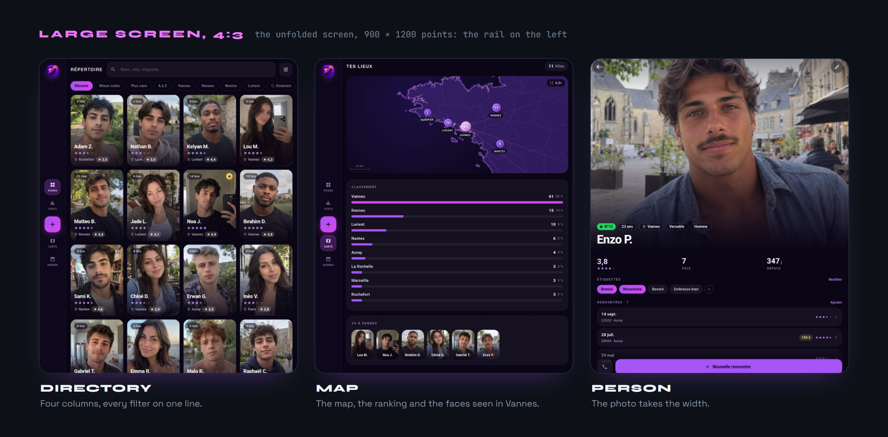

The same screen on its side is 1200 points wide. The person page then splits into two panes, the photo on the left at full height:

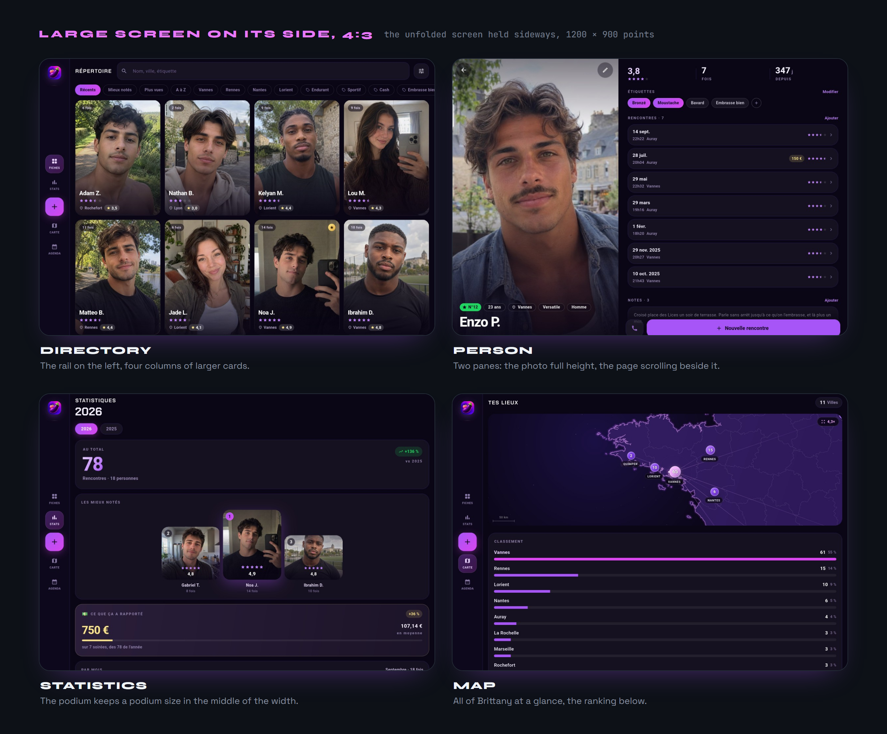

The palette follows the logo's gradient, from violet to fuchsia, on near-black backgrounds.

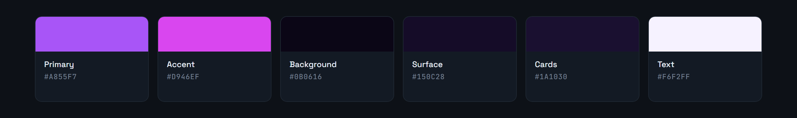

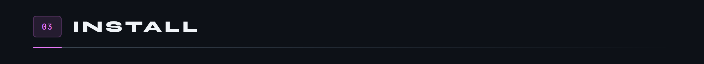


Requires the Flutter 3.x SDK and an Android device or emulator. The project follows the Flutter 3.47 template: Gradle 9.3, Android Gradle Plugin 9.1 and Kotlin 2.4, compiled by the Android plugin itself.

```bash
git clone https://github.com/Cybertrist/BodyCount.git
cd BodyCount
flutter pub get
flutter run
```

For an installable build, `flutter build apk --release --split-per-abi`. Splitting by architecture is not a nicety: SQLCipher ships one native library per ABI, and without the split the APK carries a third more weight for nothing. The release build is signed with the key named by `android/key.properties`, which git ignores; without that file, the debug key is used.

A few lines of Kotlin in `MainActivity` replace two packages. `cryptography_flutter` installed itself as the implementation of all cryptography, key derivation included, and Android refused the empty HMAC key of an unsalted extraction: the database would no longer open. `share_plus` 13 would have required a major version of `flutter_secure_storage`, where the master key lives. The activity therefore carries native AES-GCM, the file picker, sharing, saving to the gallery, reading a video's duration and one of its frames, and re-encoding it with Media3.

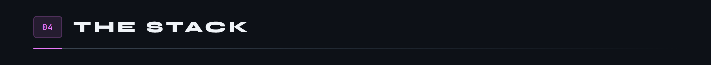

Five layers, and one rule: a layer never knows the one above it. A screen does not see SQLite, a repository does not see Riverpod, and nothing reads a vault file without going through the keyring.

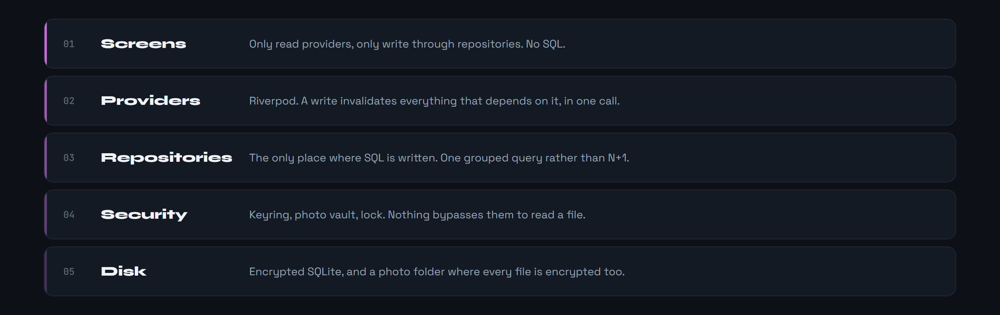

On unlock, the directory, the cities and the statistics ask for the database at the same instant. The database keeps the future of its opening, and they all await it. That was not the case at first: each started its own, one closed the other's connection while checking the key, and the other, taking the database for plain, copied it over and erased the file. The app then ran on two files, the person screen writing to one and the directory reading the other, which showed as a city that refused to change. A database is now only judged plain by its header, and one that lost its version number in the process is repaired on launch.


Six tables, schema v7. `personnes` is the hub: everything attached to a person leaves with them, and it is the schema that guarantees this, not a hand written deletion loop. Videos live in the photos table, with a type, a duration and a thumbnail: they sit in the same place on the person, leave with it, and are kept in the same vault.


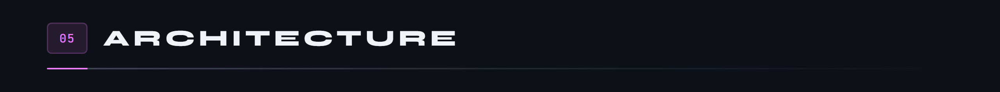

The fingerprint does not unlock a screen: it loads the master key from the Keystore. Until it has been given, the database is an unreadable file, and so are the photos and videos. Two keys are derived from it by HKDF, one for SQLCipher, one for the vault, and neither exists in memory before that.

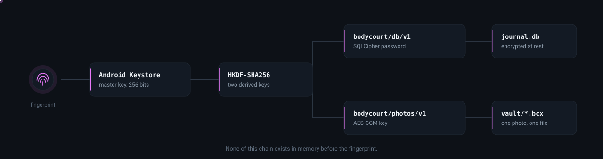

Each photo is its own file, encrypted with AES-GCM in one block, named by a UUID that says nothing about its contents. A video follows the same principle, in chunks: the next section says why. An exported backup uses the same chunked stream, except that its key comes from your passphrase rather than the Keystore: without it, the file reads back nowhere, including on the phone that produced it.


The lock closes after a spell without a gesture on screen, or on returning from the background, after a configurable delay. It waits for work in progress: a backup, a restore or a long video being encrypted involve no finger on the glass, and the system file picker sends the app to the background. It can also be switched off entirely in the settings: encryption stays, but the key then loads without proof of identity, and the screen says so before accepting. On lock, the keys are forgotten, and their bytes overwritten before being released rather than left to the garbage collector. The task switcher preview is blanked, screenshots are blocked, and Android's automatic backup is refused: it would copy the encrypted database onto servers that are not yours.

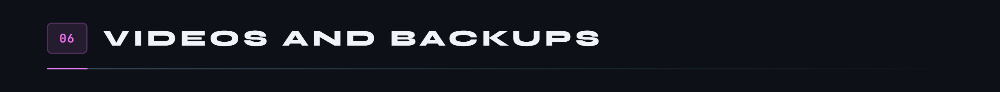

A video weighs a hundred photos. Encrypting it in one block meant holding it whole in memory, and a backup carrying videos had to hold all of them at once. Both therefore go through a stream encrypted in one megabyte chunks, written and read back on disk.


Each chunk authenticates its rank and whether it is the last, without writing them: they go into the tag computation. Swapping two chunks, removing one or cutting the end of the file makes reading fail instead of returning a truncated video without a word. AES goes through Android's encryption, which uses the processor's instructions: in pure Dart, a hundred megabytes took half a minute.

A phone films in 1080p or 4K at bitrates meant for a big screen. On import, a heavy video is re-encoded by Media3 on the hardware encoder: H.264, 720 points on the short side, 2.5 Mb/s. A 20 MB video ends up around 3. The lighter version is only kept if it saves at least a tenth.


To be played, a video is decrypted into the app's private cache, because the system player needs a file. The copy is erased when the player closes, on lock, and on the next launch if the app was killed mid-playback. A button in the viewer saves a photo or video to the phone's gallery, under Pictures or Movies, in a BodyCount folder: in the clear, since that is the whole point of the gesture, and the message says so.

A restore touches nothing before it has checked everything. The file is read twice: the first time to decrypt each chunk and drop it, the second to store the media under new names. A wrong passphrase stops at the first chunk, a damaged byte at its own, and in both cases the people on the phone are intact.


Export offers to save the file to a folder before sharing it: with videos, a backup quickly exceeds what most apps accept. Sharing goes through a temporary URI limited to the backups folder alone. When the last backup is more than a month old, or there never was one, a banner says so at the top of the directory. Backups in the old format, a ZIP encrypted in one block, still read back.

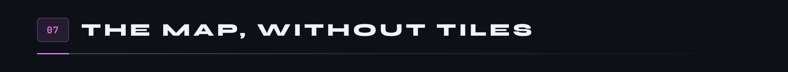

A tile map would send a server, on every drag of a finger, the exact list of places being looked at. For an app whose whole promise is that nothing leaves the phone, that was the one thing not to do. So France ships with the app.

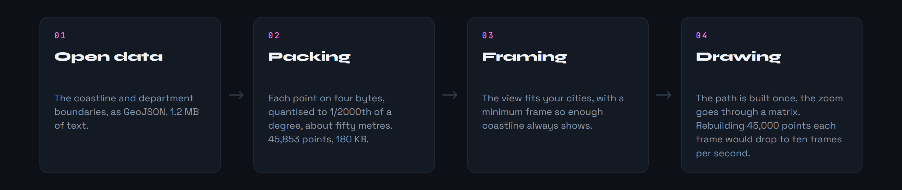

The map pinches to zoom up to twenty times, drags to pan, and the scale bar regraduates itself. It opens framed on the cities making up two thirds of the encounters, so on the real centre of activity rather than the whole country.

No pin is moved by a single pixel: at country scale, nudging a point by forty points moves it a hundred kilometres. When two cities are too close to sit side by side, they merge into one bubble carrying the sum, which splits as soon as you get close enough. Vannes and Auray are seventeen kilometres apart: no clever placement changes that, it is geography.

Cities come from the official register of French communes, shipped with the app as well: all 34,836 communes of mainland France and Corsica, from the smallest village to Paris, 420 KB once compressed in the APK. `tool/communes.mjs` rebuilds it from geo.api.gouv.fr; it is the only part of the project that touches the network, and it runs on the developer's machine, not the phone.


Everything in France gets placed. The exact name first, ignoring accents, hyphens and « St »; then a start of name, « Plougastel » for Plougastel-Daoulas; then a typo of one or two letters; then a commune name followed by a neighbourhood. At each step the most populous wins, and a department in brackets, « Saint-Denis (11) », settles namesakes. The tolerance stops at cities: « chez lui » is not a village one letter away, and an encounter place that is not a city counts for the person's city. Places abroad stay off the map, which only draws France, but appear in the ranking of places.

An encounter can also be placed by hand, at an exact point. Without tiles there are no streets to show: nearby communes, with their names, serve as landmarks. Enough to drop a pin « between Arradon and Séné », which shows on the map of places once you zoom in.

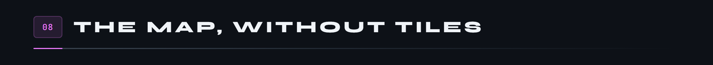

The question you ask most is not « how many » but « when »: which night was it, how long ago, was that a good stretch. A chronological list answers badly past a few dozen entries: you have to scroll and count.

The calendar answers at a glance. A month fits in seven columns: busy nights, empty weeks and streaks read without counting. An empty day is just a dimmed number; a busy one carries a disc, golden when the night earned something. Tap it to see only that day in the list below.

Under each day, up to three signs say what it had of note, rarest first: the year's best amount before the hundred euros, the hundred euros before a plain banknote, the month's best rating before a five out of five. Twenty-five signs in all, every one derived from what the app already records, none to enter by hand. A legend reachable from the header states exactly what triggers each: not « a good night » but « a five out of five rating », so you know what to enter if you want to see one appear.

Always six weeks on screen, even when the month only fills five: a grid whose height depends on the month makes the whole screen jump as you leaf through it.


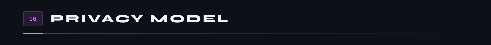

What breaks silently is what touches the disk: opening the database, its migrations, encryption, backups. Yet SQLCipher, the Keystore and native AES only exist on Android. The tests therefore run on an emulator, against the real libraries, rather than against stand-ins that would pass where the app fails. Six of them drive the whole app, by finger, from one screen to the next.

```bash
flutter test integration_test -d emulator-5554
```

They destroy the data and the key of the app they target: run them on an emulator, never on the phone holding the real journal.


They paid off on their first run. The data tests found a backup end marker written on eleven bytes and read on one: no restore would have gone through. The screen tests found a row of figures overflowing its fixed height on the person page.

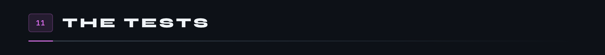

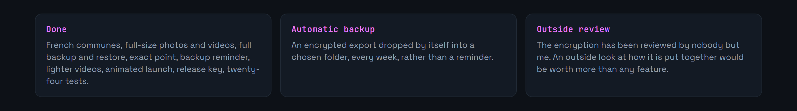

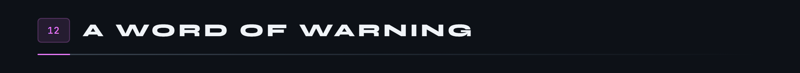

This repository is a personal project, not a security product. The encryption rests on proven primitives and on Android's Keystore, but the assembly itself has been reviewed by nobody other than me. If you plan to put data in it whose leak would cost you something, read the code first, or don't.

The demo set looks for its faces in `assets/demo/`, which is not part of the repository. Without them the eighteen people are still created, simply without a photo: the generator copes with every missing image.

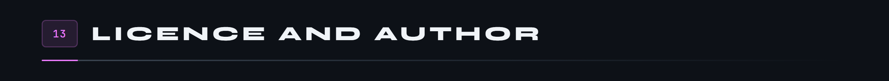

BodyCount is designed and built by **Tristan Joncour** ([@Cybertrist](https://github.com/Cybertrist)), a cyber defence engineering student at ENSIBS, for his own use first: it is the app he wanted on his phone, and it did not exist.

The code is released under the [MIT](LICENSE) licence: free to read, reuse and modify, as long as the copyright notice stays. The geometry of France and the register of communes come from open data; the Chakra Petch typeface is under the SIL Open Font licence; the fingerprint icon in the diagrams comes from Material Design, under the Apache 2.0 licence.

---

<sub>None of the images on this page come out of a drawing tool: they are HTML pages captured by Chrome, plus six animated SVGs. The screenshots come from an emulator driven by script, trimmed of their bars by <code>rogner.js</code>. Everything lives in <a href="docs/tools/">docs/tools</a>, and <code>bash docs/tools/tout.sh</code> rebuilds it all, in both languages, social preview included.</sub>
