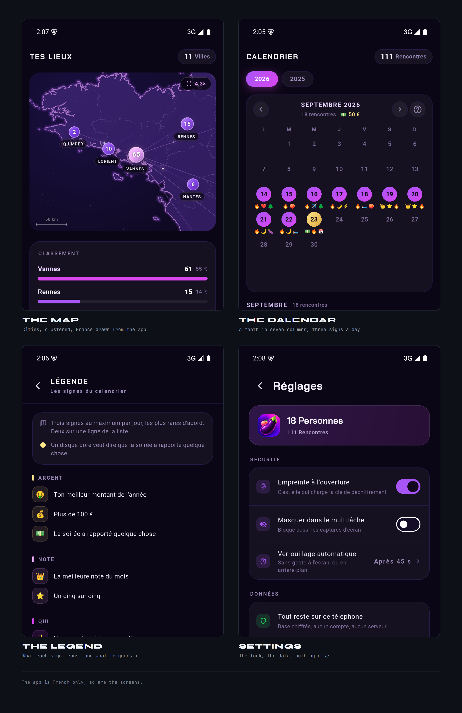
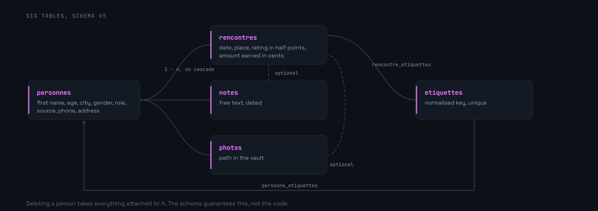
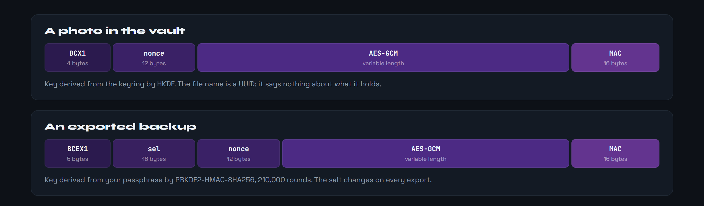

<div align="center">

<p>
  <a href="README.md"></a>
  
</p>


</div>

**An encrypted personal journal, offline, on Android.**

> **Work in progress.** The app runs on a real device and every screen is there, but a few things are still to wire in. The roadmap is further down.

A personal tracking app that talks to no server. Everything lives in an encrypted SQLite file on the phone, behind a fingerprint that does not unlock a screen but the key itself, and nothing leaves unless you explicitly ask for a backup, which is encrypted too.

What drew me to the project was the constraint: building something useful on sensitive data **without** a backend, without an account, without telemetry. Every design decision follows from that, including the map, which draws France from geometry shipped inside the app rather than fetching tiles.




These four show no face, which is exactly why they are the ones here: the repository's demo set is made of portraits that have no business on a public page. They are, incidentally, the only files of the project kept out of the repository.


Requires the Flutter 3.x SDK and an Android device or emulator.

```bash
git clone https://github.com/Cybertrist/BodyCount.git
cd BodyCount
flutter pub get
flutter run
```

For an installable build, `flutter build apk --release --split-per-abi`. Splitting by architecture is not a nicety: SQLCipher ships one native library per ABI, and without the split the APK carries a third more weight for nothing.


Five layers, and one rule: a layer never knows the one above it. A screen does not see SQLite, a repository does not see Riverpod, and nothing reads a vault file without going through the keyring.


Six tables, schema v5. `personnes` is the hub: everything attached to a person leaves with them, and it is the schema that guarantees this, not a hand written deletion loop.




The fingerprint does not unlock a screen: it loads the master key from the Keystore. Until it has been given, the database is an unreadable file and so are the photos. Two keys are derived from it by HKDF, one for SQLCipher, one for the photos, and neither exists in memory before that.


Each photo is its own file, encrypted with AES-GCM, named by a UUID that says nothing about its contents. An exported backup follows the same principle, except that its key comes from your passphrase rather than the Keystore: without it, the archive reads back nowhere, including on the phone that produced it.



The lock closes after a spell without a gesture on screen, or on returning from the background, after a configurable delay. It can also be switched off entirely in the settings: encryption stays, but the key then loads without proof of identity, and the screen says so before accepting. The keys are forgotten then, and their bytes overwritten before being released rather than left to the garbage collector. The task switcher preview is blanked, screenshots are blocked, and Android's automatic backup is refused: it would copy the encrypted database onto servers that are not yours.


A tile map would send a server, on every drag of a finger, the exact list of places being looked at. For an app whose whole promise is that nothing leaves the phone, that was the one thing not to do. So France ships with the app.


The map pinches to zoom up to twenty times, drags to pan, and the scale bar regraduates itself. It opens framed on the cities making up two thirds of the encounters, so on the real centre of activity rather than the whole country.

No pin is moved by a single pixel: at country scale, nudging a point by forty points moves it a hundred kilometres. When two cities are too close to sit side by side, they merge into one bubble carrying the sum, which splits as soon as you get close enough. Vannes and Auray are seventeen kilometres apart: no clever placement changes that, it is geography.

At high magnification only the outlines touching the window are drawn. Paying for all forty-five thousand points every frame dropped the display to a few frames per second, and the coastal glow, which was a mask blur, forced the engine to render the country into a separate layer before blurring it.

Cities come from a coordinate table that ships with the app as well, covering France and a few nearby capitals. A city missing from that table is not dropped somewhere at random: it is listed under the map, with its count. Inventing a position would be worse than admitting there isn't one.


The screen used to be called « Timeline », and that is what it was: one long list, newest first. It answered « when was that » provided you scrolled to the right date, which stops making sense past a few dozen entries.

A month fits in seven columns. Busy nights, empty weeks and streaks read at a glance, without counting. An empty day is just a dimmed number; a busy one carries a disc, golden when the night earned something. Tap it to see only that day in the list below.

Under each day, up to three signs say what it had of note, rarest first: the year's best amount before the hundred euros, the hundred euros before a plain banknote, the month's best rating before a five out of five. Twenty-five signs in all, every one derived from what the app already records, none to enter by hand. A legend reachable from the header states exactly what triggers each: not « a good night » but « a five out of five rating », so you know what to enter if you want to see one appear.

Always six weeks on screen, even when the month only fills five: a grid whose height depends on the month makes the whole screen jump as you leaf through it.


This repository is a personal project, not a security product. The encryption rests on proven primitives and on Android's Keystore, but the assembly itself has been reviewed by nobody other than me. If you plan to put data in it whose leak would cost you something, read the code first, or don't.

The demo set looks for its faces in `assets/demo/`, which is not part of the repository. Without them the eighteen people are still created, simply without a photo: the generator copes with every missing image.

---

<sub>None of the images on this page come out of a drawing tool: they are HTML pages captured by Chrome, plus one animated SVG. The scripts live in <a href="docs/tools/">docs/tools</a>, and <code>bash docs/tools/tout.sh</code> rebuilds them all, in both languages.</sub>
