<div align="center">

<p>
  <a href="README.md"></a>
  
</p>


<br><br>

</div>

I wanted one place to keep what surrounds my encounters: a photo, a few notes about the person, a verdict on the night, tags to remember them by, an address, sometimes what it earned. Highly sensitive information, which has no business in the phone's contacts or in an app that would send it to a server, and which you still want to find in two seconds, neatly sorted, with statistics that make something of it.

Nothing out there did both: keep all of it properly organised, and keep it to yourself. That is where BodyCount comes from. Everything lives in an encrypted database on the phone, behind a fingerprint that does not unlock a screen but the key itself. No server, no account, no telemetry: nothing leaves, except a backup you explicitly ask for, encrypted as well by a passphrase.

Every design decision follows from that constraint, down to the map, which draws France and its 34,836 communes from data shipped inside the app rather than fetching tiles from the internet.


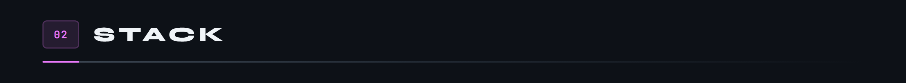

The app is designed first for the passport format, the cover screen of a Galaxy Z Fold: wide and short. That is where it gets used every day, so it carries the full sheet. The faces come from the demo set, generated portraits: nobody real.


On launch, Android puts the icon in the centre; the app picks it up at the same spot, draws a ring around it, raises its name, then slides the logo and title to their exact place on the lock screen. You cannot tell where one ends and the other begins. The fingerprint prompt only comes once the animation is over.

On a regular 16:9 phone, the layout drops to two columns and moves search below the title:



And on the unfolded 4:3 screen, navigation becomes a rail on the left and the directory goes to four columns:

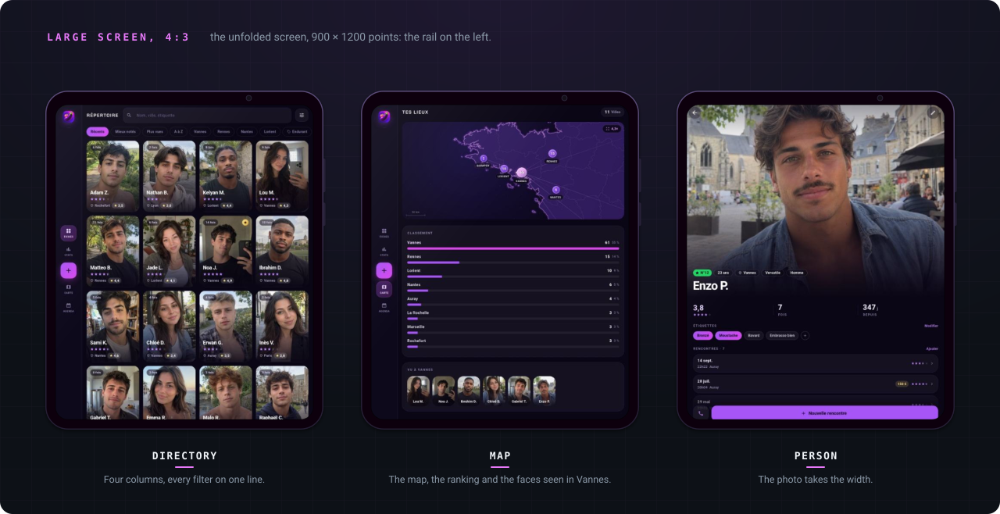

The same screen on its side is 1200 points wide. The person page then splits into two panes, the photo on the left at full height:

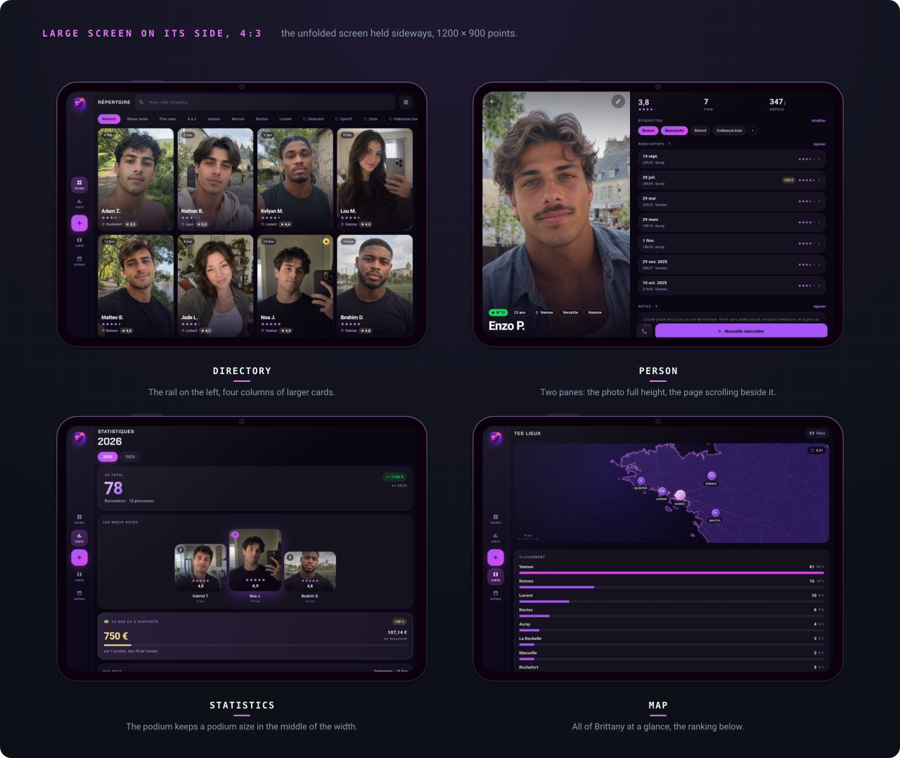

The people list filters as you type: every letter reruns a single query on the encrypted database, looking in the first name, the city and the tags. City and tag chips add to the search instead of replacing it, and a sort only changes the order of that same query.


Logging an encounter takes six fields, all optional except the date, which is already set to now. The rating goes by half points, touching half a star, and an amount left empty means nothing, not a time worth zero euros. On save, a single function, `rafraichir()`, reloads the card, the rank, the people list, the statistics, the calendar and the map: no screen keeps a stale number.


Every figure on the stats screen comes from an SQL query, not a loop in the app: the database sends back twelve integers for the twelve bars, not every encounter. The average earnings only count paid nights, and a year with nothing before it shows no percentage rather than dividing by zero. Total, earnings and months follow the chosen year; the podium and roles cover every card.


The palette follows the logo's gradient, from violet to fuchsia, on near-black backgrounds.


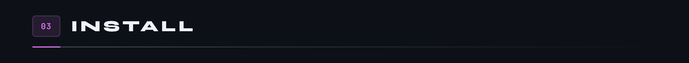

The APK lives in the repository's [Releases](https://github.com/Cybertrist/BodyCount/releases/latest), not in the code: a binary of nearly thirty megabytes versioned with the sources would stay in the history forever, and every clone would drag it along, once per version. Both links below always lead to the latest one.

There are two apps, and they install side by side. **BodyCount**, the real one, starts empty and waits for your people. **BodyCount demo** is a separate app, filled with the eighteen people of the sample set, with their photos, their encounters and their notebooks: enough to go through everything without typing anything. It opens without a fingerprint and lets screenshots through; the lock can be switched back on in its settings.

<p align="center">
  <a href="https://github.com/Cybertrist/BodyCount/releases/latest/download/BodyCount.apk"></a>
  <a href="https://github.com/Cybertrist/BodyCount/releases/latest/download/BodyCount-demo.apk">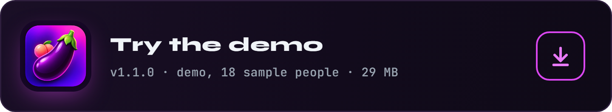</a>
</p>

It needs Android 7 or later on a 64-bit processor, which means any phone from recent years. Since it does not go through the Play Store, Android will ask you to allow installs from the app that opens it, the browser or the file manager.

For an app that will hold this kind of data, two checks are worth the minute they take. The file's fingerprint must match the one published with the release:

```bash
sha256sum BodyCount.apk BodyCount-demo.apk
# 6fd713f7036788d57fe95d8a6f9a27f030374d7c9264f9d8e83d0cfbce569bd4  BodyCount.apk
# e2bdd13500aa165746168fde9b5319c3df97f41ae81b96408de12f0be28235f2  BodyCount-demo.apk
```

And the certificate that signs it must be this one, the same for every version. Android refuses an update signed with another key, which also rules out an APK tampered with on the way:

```bash
apksigner verify --print-certs BodyCount.apk
# SHA-256: ac09674e066658991aeb60f02e1386423b5e14dede4bd6c844f542785fef86d1
```

The demo is signed with the same key.

The real app does not contain the sample set: not the eighteen people, not their faces, not the settings row that creates them. Only the demo carries them, and since its identifier is different, it never reads or writes the real app's database.

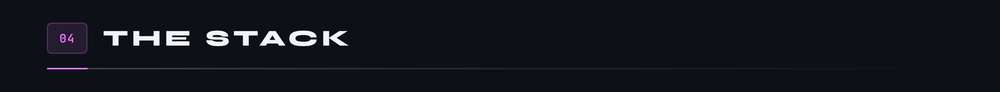


Requires the Flutter 3.x SDK and an Android device or emulator. The project follows the Flutter 3.47 template: Gradle 9.3, Android Gradle Plugin 9.1 and Kotlin 2.4, compiled by the Android plugin itself.

```bash
git clone https://github.com/Cybertrist/BodyCount.git
cd BodyCount
flutter pub get
flutter run --flavor complete
```

For an installable build, `flutter build apk --release --split-per-abi --flavor complete`, and for the demo `--flavor demo --dart-define=DEMO=true`. Every build names its variant, `flutter run` too: `flutter run --flavor complete`. Splitting by architecture is not a nicety: SQLCipher ships one native library per ABI, and without the split the APK carries a third more weight for nothing. The release build is signed with the key named by `android/key.properties`, which git ignores; without that file, the debug key is used.

A few lines of Kotlin in `MainActivity` replace two packages. `cryptography_flutter` installed itself as the implementation of all cryptography, key derivation included, and Android refused the empty HMAC key of an unsalted extraction: the database would no longer open. `share_plus` 13 would have required a major version of `flutter_secure_storage`, where the master key lives. The activity therefore carries native AES-GCM, the file picker, sharing, saving to the gallery, reading a video's duration and one of its frames, and re-encoding it with Media3.

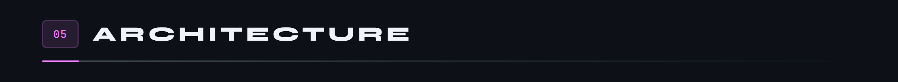

Five layers, and one rule: a layer never knows the one above it. A screen does not see SQLite, a repository does not see Riverpod, and nothing reads a vault file without going through the keyring.


On unlock, the directory, the cities and the statistics ask for the database at the same instant. The database keeps the future of its opening, and they all await it. That was not the case at first: each started its own, one closed the other's connection while checking the key, and the other, taking the database for plain, copied it over and erased the file. The app then ran on two files, the person screen writing to one and the directory reading the other, which showed as a city that refused to change. A database is now only judged plain by its header, and one that lost its version number in the process is repaired on launch.


Seven tables, schema v7: five, plus two link tables for tags. `personnes` is the hub: everything attached to a person leaves with them, and it is the schema that guarantees this, not a hand written deletion loop. Videos live in the photos table, with a type, a duration and a thumbnail: they sit in the same place on the person, leave with it, and are kept in the same vault.


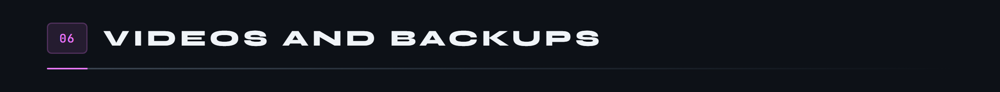

The fingerprint does not unlock a screen: it is what brings the master key into memory. That 32-byte key, drawn at random on first launch, sleeps in preferences encrypted by the Android Keystore; until Android has recognised your finger or your PIN, the database, the photos and the videos are just noise on the disk. Two keys are derived from it by HKDF, each with its own label, one for SQLCipher, the other for the vault, and neither exists in memory before.


Each photo is its own file, encrypted with AES-GCM in one block, named by a UUID that says nothing about its contents. A video follows the same principle, in chunks: the next section says why. An exported backup uses the same chunked stream, except that its key comes from your passphrase rather than the Keystore: without it, the file reads back nowhere, including on the phone that produced it.


The lock closes after a spell without a gesture on screen, or on returning from the background, after a configurable delay. It waits for work in progress: a backup, a restore or a long video being encrypted involve no finger on the glass, and the system file picker sends the app to the background. It can also be switched off entirely in the settings: encryption stays, but the key then loads without proof of identity, and the screen says so before accepting. On lock, the keys are forgotten, and their bytes overwritten before being released rather than left to the garbage collector. The task switcher preview is blanked, screenshots are blocked, and Android's automatic backup is refused: it would copy the encrypted database onto servers that are not yours.


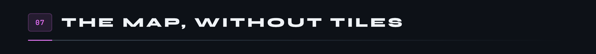

A photo or a video never enters BodyCount in the clear. The copy handed over by the Android picker is encrypted into the app's vault, then deleted, and nothing shows up in the phone's gallery. To display it, the photo is decrypted in memory and the video in the private cache while it plays. Only the download button puts a copy in the clear into the gallery, and only when you ask for it.


A video weighs a hundred photos. Encrypting it in one block meant holding it whole in memory, and a backup carrying videos had to hold all of them at once. Both therefore go through a stream encrypted in one megabyte chunks, written and read back on disk.


Each chunk authenticates its rank and whether it is the last, without writing them: they go into the tag computation. Swapping two chunks, removing one or cutting the end of the file makes reading fail instead of returning a truncated video without a word. AES goes through Android's encryption, which uses the processor's instructions: in pure Dart, a hundred megabytes took half a minute.

A phone films in 1080p or 4K at bitrates meant for a big screen. On import, a heavy video is re-encoded by Media3 on the phone encoder: H.264, 720 points on the short side, 2.5 Mb/s, sound as is. A 20 MB video comes out at about 3. Re-encoding always costs a little: a video that is already light is left alone, and the shrunk version is only kept if it saves at least a tenth. If the encoder fails, the original goes into the vault.


To be played, a video is decrypted into the app's private cache, because the system player needs a file. The copy is erased when the player closes, on lock, and on the next launch if the app was killed mid-playback. A button in the viewer saves a photo or video to the phone's gallery, under Pictures or Movies, in a BodyCount folder: in the clear, since that is the whole point of the gesture, and the message says so.

A backup is encrypted with a passphrase, not with the phone's key, so it can be read back on another device. The passphrase goes through PBKDF2 for 210,000 rounds, then the file is written as a stream: the cards first, then every photo and video, taken out of the vault and re-encrypted straight away, never touching the disk in the clear. Once the file is saved where you want it, the date is noted and the reminder in the people list stays quiet for a month.


A restore touches nothing before it has checked everything. The file is read twice: first to decrypt each chunk and drop it, then to store the media under new names, next to the old ones. The cards are only replaced at the very end. A wrong passphrase stops at the first chunk, a damaged byte at its own, and a cut-off halfway only deletes the files it had just added: either way, the cards on the phone are intact.


Export offers to save the file to a folder before sharing it: with videos, a backup quickly exceeds what most apps accept. Sharing goes through a temporary URI limited to the backups folder alone. When the last backup is more than a month old, or there never was one, a banner says so at the top of the directory. Backups in the old format, a ZIP encrypted in one block, still read back.

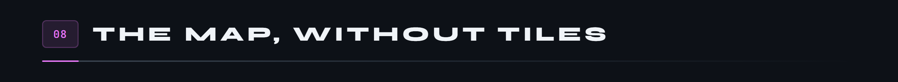

A tile map would send a server, on every drag of a finger, the exact list of places being looked at. For an app whose whole promise is that nothing leaves the phone, that was the one thing not to do. So France ships with the app.


The map opens tight on your cities, not all of them: it starts from the main one and widens until two thirds of your encounters are in. Two cities too close to sit side by side become a single bubble carrying the sum; the disks never move, and moving closer is what splits them.


The map pinches to zoom up to twenty times, drags to pan, and the scale bar regraduates itself. It opens framed on the cities making up two thirds of the encounters, so on the real centre of activity rather than the whole country.

No pin is moved by a single pixel: at country scale, nudging a point by forty points moves it a hundred kilometres. When two cities are too close to sit side by side, they merge into one bubble carrying the sum, which splits as soon as you get close enough. Vannes and Auray are seventeen kilometres apart: no clever placement changes that, it is geography.

Cities come from the official register of French communes, shipped with the app as well: all 34,836 communes of mainland France and Corsica, from the smallest village to Paris, 420 KB once compressed in the APK. `tool/communes.mjs` rebuilds it from geo.api.gouv.fr; it is the only part of the project that touches the network, and it runs on the developer's machine, not the phone. The exact spot already opens centred on the commune the typed place lands on.


Everything in France gets placed. The exact name first, ignoring accents, hyphens and « St »; then a start of name, « Plougastel » for Plougastel-Daoulas; then a typo of one or two letters; then a commune name followed by a neighbourhood. At each step the most populous wins, and a department in brackets, « Saint-Denis (11) », settles namesakes. The tolerance stops at cities: « chez lui » is not a village one letter away, and an encounter place that is not a city counts for the person's city. Places abroad stay off the map, which only draws France, but appear in the ranking of places.

An encounter can also be placed by hand, at an exact point. Without tiles there are no streets to show: nearby communes, with their names, serve as landmarks. Enough to drop a pin « between Arradon and Séné », which shows on the map of places once you zoom in.


The question you ask most is not « how many » but « when »: which night was it, how long ago, was that a good stretch. A chronological list answers badly past a few dozen entries: you have to scroll and count.

The calendar answers at a glance. A month fits in seven columns: busy nights, empty weeks and streaks read without counting. An empty day is just a dimmed number; a busy one carries a disc, golden when the night earned something. Tap it to see only that day in the list below.

Under each day, up to three signs say what it had of note, rarest first: the year's best amount before the hundred euros, the hundred euros before a plain banknote, the month's best rating before a five out of five. Twenty-five signs in all, every one derived from what the app already records, none to enter by hand. A legend reachable from the header states exactly what triggers each: not « a good night » but « a five out of five rating », so you know what to enter if you want to see one appear.


A day can earn far more than three signs: the 23rd has six. They get sorted from rarest to most common, and only the first three fit under the disc, the first two on the list row. The rest is not lost, there is simply no room for it.

Always six weeks on screen, even when the month only fills five: a grid whose height depends on the month makes the whole screen jump as you leaf through it.

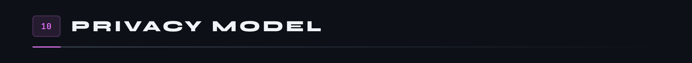


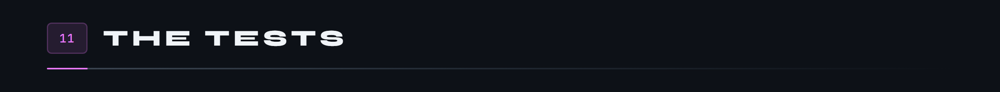

What breaks silently is what touches the disk: opening the database, its migrations, encryption, backups. Yet SQLCipher, the Keystore and native AES only exist on Android. The tests therefore run on an emulator, against the real libraries, rather than against stand-ins that would pass where the app fails. Six of them drive the whole app, by finger, from one screen to the next.

```bash
flutter test integration_test -d emulator-5554 --flavor complete
```

They destroy the data and the key of the app they target: run them on an emulator, never on the phone holding the real journal.


They paid off on their first run. The data tests found a backup end marker written on eleven bytes and read on one: no restore would have gone through. The screen tests found a row of figures overflowing its fixed height on the person page.

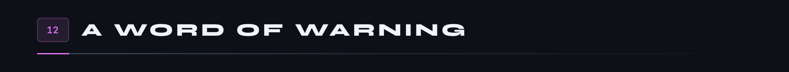

"No network requests" is easy to write. Here it is not a promise made by the code but an Android rule: the app does not ask for the `INTERNET` permission, and without it the system refuses to open any connection at all. A bug, a chatty library, a dependency poisoned in its next update: everything hits the same wall, which is not inside the app and which the app cannot get past.

It can be checked on the APK itself, without reading a line of code:

```bash
aapt2 dump permissions app-arm64-v8a-release.apk
```

The list is short: the fingerprint, under its current name and its old one, then `WAKE_LOCK` and `ACCESS_NETWORK_STATE`, added by libraries. The first keeps the phone from falling asleep mid-task, the second tells whether a network is there, without allowing any use of it.

Four exits remain, and none of them opens by itself. Each one waits for a finger, and hands over to another app, which then answers for what it does with it:


The last one is the only one that leaves a plain trace: a downloaded photo becomes a photo like any other, visible to the gallery and to anything that reads it. That is the price of "I want to keep it somewhere else", and the app only pays it on request.

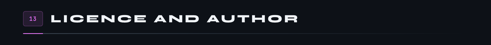

This repository is a personal project, not a security product. The encryption rests on proven primitives and on Android's Keystore, but the assembly itself has been reviewed by nobody other than me. If you plan to put data in it whose leak would cost you something, read the code first, or don't.

The sample set only exists in the demo, and in a working build compiled with `--dart-define=ESSAIS=true`. Its faces, generated portraits of no one real, are not part of the repository: to build the demo, they go into `assets/demo/`; for a working build, onto the phone, with `adb push assets/demo/. /sdcard/Android/data/com.bodycount.bodycount/files/demo/`. Without them the eighteen people are still created, simply without a photo: the generator copes with every missing image.


BodyCount is designed and built by **Tristan Joncour** ([@Cybertrist](https://github.com/Cybertrist)), a cyber defence engineering student at ENSIBS, for his own use first: it is the app he wanted on his phone, and it did not exist.

The code is released under the [MIT](LICENSE) licence: free to read, reuse and modify, as long as the copyright notice stays. The geometry of France and the register of communes come from open data; the Chakra Petch typeface is under the SIL Open Font licence; the fingerprint icon in the diagrams comes from Material Design, under the Apache 2.0 licence.

---

<sub>None of the images on this page come out of a drawing tool: they are HTML pages captured by Chrome, plus six animated SVGs. The screenshots come from an emulator driven by script, trimmed of their bars by <code>rogner.js</code>. Everything lives in <a href="docs/tools/">docs/tools</a>, and <code>bash docs/tools/tout.sh</code> rebuilds it all, in both languages, social preview included.</sub>
