<div align="center">

<p>
  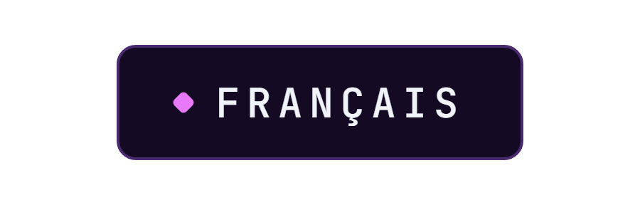
  <a href="README.en.md"></a>
</p>


</div>

**Journal personnel chiffré, hors ligne, sur Android.**

> **Projet en cours.** L'application tourne sur un appareil réel, tous les écrans sont là, mais il reste des choses à brancher. La feuille de route est plus bas.

Une application de suivi personnel qui ne parle à aucun serveur. Tout vit dans un SQLite chiffré sur le téléphone, derrière une empreinte qui ne déverrouille pas un écran mais la clé elle même, et n'en sort que si on demande explicitement une sauvegarde, chiffrée elle aussi.

Le projet m'intéressait surtout pour la contrainte : construire quelque chose d'utile sur des données sensibles **sans** backend, sans compte, sans télémétrie. Toute la conception découle de là, y compris la carte, qui dessine la France à partir d'une géométrie embarquée plutôt que d'aller chercher des tuiles.


Ces quatre là ne montrent aucun visage, et c'est la raison pour laquelle ce sont ceux qui sont ici : le jeu d'essai du dépôt est fait de portraits qui n'ont rien à faire dans une page publique. Ils sont d'ailleurs les seuls fichiers du projet à rester hors du dépôt.


Nécessite le SDK Flutter 3.x et un appareil ou un émulateur Android.

```bash
git clone https://github.com/Cybertrist/BodyCount.git
cd BodyCount
flutter pub get
flutter run
```

Pour une version installable, `flutter build apk --release --split-per-abi`. Le découpage par architecture n'est pas de la coquetterie : SQLCipher embarque une bibliothèque native par ABI, et sans lui l'APK pèse un tiers de plus pour rien.


Cinq couches, et une règle : une couche ne connaît jamais celle du dessus. Un écran ne voit pas SQLite, un dépôt ne voit pas Riverpod, et rien ne lit un fichier du coffre sans passer par le trousseau.

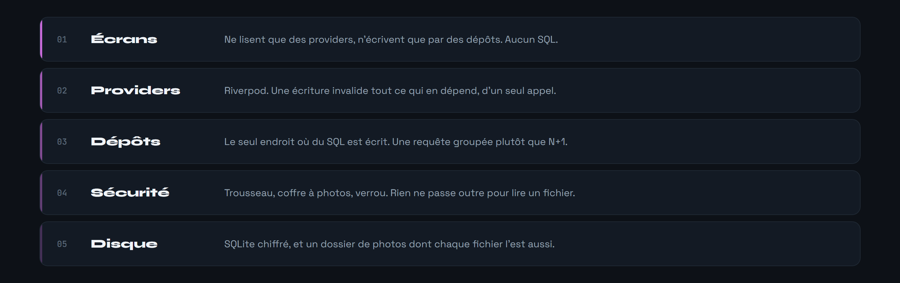

Six tables, schéma v5. `personnes` est le pivot : tout ce qui s'y rattache part avec elle, et c'est le schéma qui le garantit, pas une boucle de suppression écrite à la main.

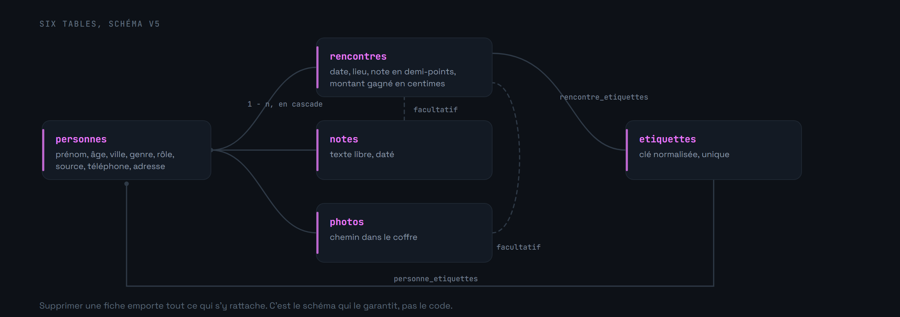


L'empreinte ne déverrouille pas un écran : elle charge la clé maîtresse depuis le Keystore. Tant qu'elle n'a pas été donnée, la base est un fichier illisible et les photos aussi. Deux clés en sont dérivées par HKDF, l'une pour SQLCipher, l'autre pour les photos, et aucune n'existe en mémoire avant.

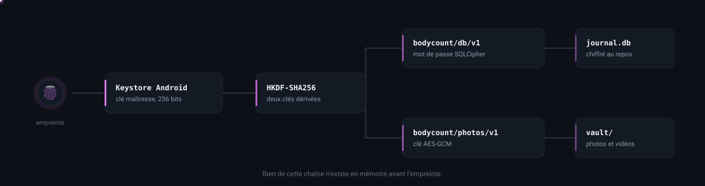

Chaque photo est un fichier à part, chiffré en AES-GCM, nommé par un UUID qui ne dit rien de son contenu. Une sauvegarde exportée suit le même principe, sauf que sa clé vient de ta phrase de passe plutôt que du Keystore : sans elle, l'archive ne se relit nulle part, y compris sur le téléphone qui l'a produite.

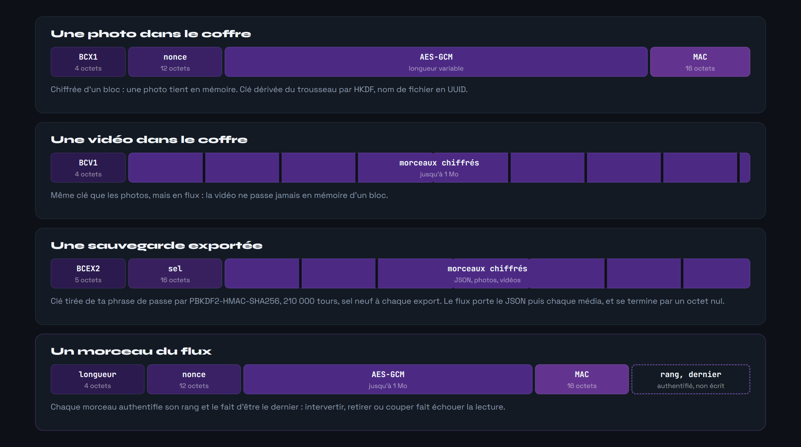

Le verrou se referme sans geste à l'écran, ou au retour d'arrière-plan, après un délai réglable. Il se coupe aussi entièrement dans les réglages : le chiffrement reste, mais la clé se charge alors sans preuve d'identité, et l'écran le dit avant de l'accepter. Les clés sont alors oubliées, et leurs octets écrasés avant d'être lâchés plutôt que laissés au ramasse-miettes. L'aperçu du multitâche est masqué, les captures d'écran bloquées, et la sauvegarde automatique d'Android refusée : elle recopierait la base chiffrée sur des serveurs qui ne sont pas les tiens.

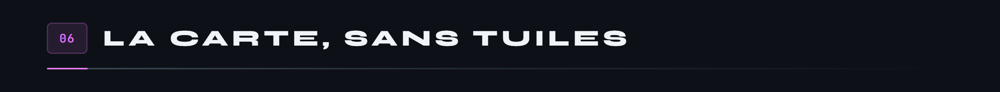

Une carte à tuiles enverrait à un serveur, à chaque déplacement du doigt, la liste exacte des endroits regardés. Pour une application dont toute la promesse est que rien ne sort du téléphone, c'était la seule chose à ne pas faire. La France est donc embarquée.

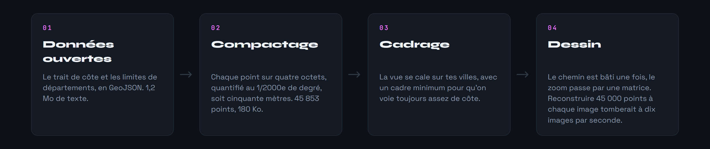

La carte se pince pour zoomer jusqu'à vingt fois, se traîne pour se déplacer, et la règle se regradue toute seule. Elle s'ouvre cadrée sur les villes qui font les deux tiers des rencontres, donc sur le vrai cœur d'activité plutôt que sur le pays entier.

Aucune pastille n'est déplacée d'un pixel : à l'échelle d'un pays, écarter un point de quarante points le déplace de cent kilomètres. Quand deux villes sont trop proches pour tenir côte à côte, elles se réunissent en une bulle qui porte la somme, et qui se scinde dès qu'on s'approche assez. Vannes et Auray sont à dix-sept kilomètres : aucun placement malin n'y change quoi que ce soit, c'est de la géographie.

À fort grossissement, seuls les contours qui touchent la fenêtre sont dessinés. Payer les quarante-cinq mille points à chaque image faisait tomber l'affichage à quelques images par seconde, et le halo de côte, qui était un flou de masque, obligeait le moteur à rendre le pays dans une couche à part avant de la flouter.

Les villes viennent du référentiel officiel des communes, embarqué lui aussi : les 34 836 communes de métropole et de Corse, du plus petit village à Paris, 420 Ko une fois compressées dans l'APK. `tool/communes.mjs` le reconstruit depuis geo.api.gouv.fr, c'est le seul endroit du projet qui touche au réseau, et il tourne sur la machine du développeur, pas sur le téléphone. Tout ce qui est en France est posé : une faute de frappe, un nom coupé ou suivi d'un quartier tombent sur la commune la plus proche par le nom, et un département entre parenthèses, « Saint-Denis (11) », départage les homonymes. Un lieu de rencontre qui n'est pas une ville, « chez lui », compte pour la ville de la fiche. L'étranger reste hors de la carte, qui ne dessine que la France.

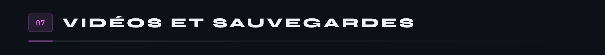

L'écran s'appelait « Frise », et c'en était une : une seule longue liste, du plus récent au plus ancien. Elle répondait à « c'était quand » à condition de défiler jusqu'à la bonne date, ce qui devient absurde passé quelques dizaines d'entrées.

Un mois tient sur sept colonnes. Les soirs pleins, les semaines vides et les séries se lisent d'un coup, sans compter. Un jour vide n'est qu'un chiffre effacé ; un jour plein porte un disque, doré quand la soirée a rapporté. On tape dessus pour n'avoir que lui dans la liste en dessous.

Sous chaque jour, jusqu'à trois signes disent ce qu'il a eu de remarquable, du plus rare au plus banal : le meilleur montant de l'année avant les cent euros, les cent euros avant un simple billet, la meilleure note du mois avant un cinq sur cinq. Vingt-cinq signes en tout, tous déduits de ce que l'application enregistre déjà, aucun à saisir en plus. Une légende accessible depuis l'en-tête dit précisément ce qui déclenche chacun : pas « une bonne soirée » mais « une note de cinq sur cinq », pour qu'on sache quoi saisir si on veut le voir apparaître.

Toujours six semaines affichées, même quand le mois n'en occupe que cinq : une grille dont la hauteur dépend du mois fait sauter tout l'écran quand on le feuillette.

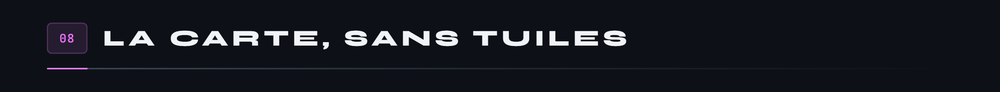


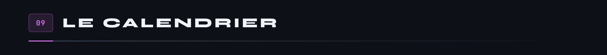


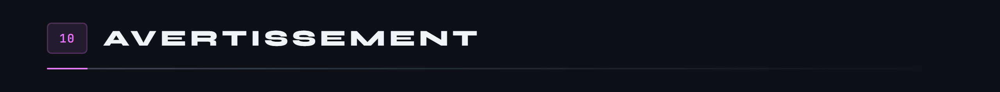

Ce dépôt est un projet personnel, pas un produit de sécurité. Le chiffrement s'appuie sur des primitives éprouvées et sur le Keystore d'Android, mais l'assemblage, lui, n'a été relu par personne d'autre que moi. Si tu comptes y mettre des données dont la fuite te coûterait quelque chose, lis le code avant, ou ne le fais pas.

Le jeu d'essai attend ses visages dans `assets/demo/`, qui ne fait pas partie du dépôt. Sans eux les dix-huit fiches se créent quand même, simplement sans photo : le générateur se passe de chaque image absente.

---

<sub>Les images de cette page ne sortent d'aucun logiciel de dessin : ce sont des pages HTML que Chrome capture, et un SVG animé. Les scripts sont dans <a href="docs/tools/">docs/tools</a>, et <code>bash docs/tools/tout.sh</code> les refait toutes, dans les deux langues.</sub>
