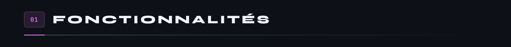
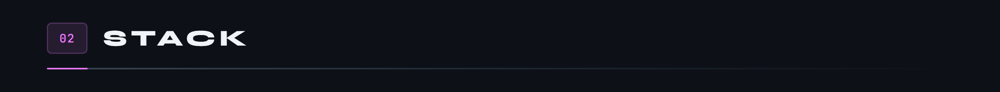
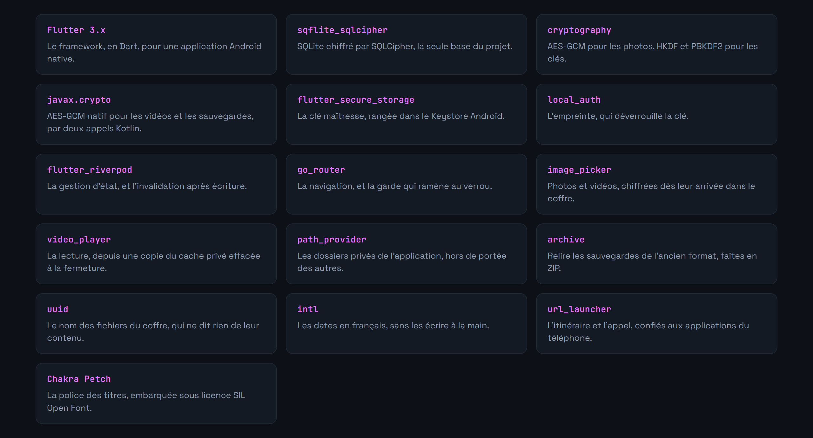
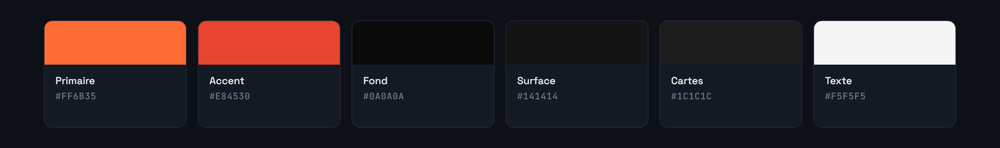
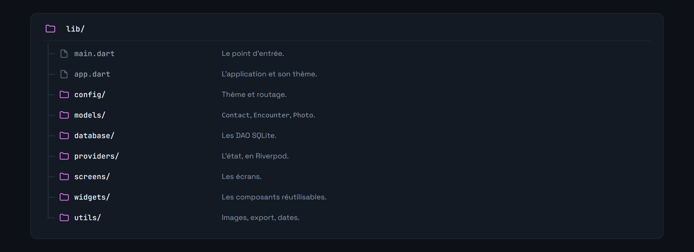
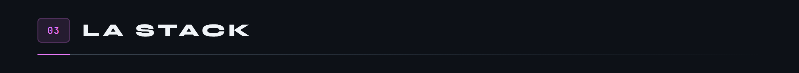
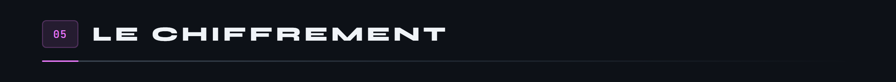

<div align="center">


</div>

**Journal personnel chiffré, hors ligne, sur Android.**

> **Projet en cours.** L'application est fonctionnelle mais pas terminée, voir la feuille de route plus bas.

Une application de suivi personnel qui ne parle à aucun serveur. Tout vit dans un SQLite sur le téléphone, derrière une authentification biométrique, et n'en sort que si on demande explicitement un export.

Le projet m'intéressait surtout pour la contrainte : construire quelque chose d'utile sur des données sensibles **sans** backend, sans compte, sans télémétrie. Toute la conception découle de là.












Nécessite le SDK Flutter 3.x et un appareil ou un émulateur Android.

```bash
git clone https://github.com/Cybertrist/BodyCount.git
cd BodyCount
flutter pub get
flutter run
```



C'est le point central du projet, donc autant être précis sur ce qui est garanti et ce qui ne l'est pas.


La distinction compte. Une application qui promet la confidentialité et livre seulement un verrou d'interface fait plus de mal qu'une application qui n'a rien promis.




L'application enregistre des données intimes concernant des personnes réelles, qui n'ont pas consenti à y figurer. Le RGPD prévoit une exemption pour les usages strictement personnels et domestiques, mais elle tombe dès que les données sont partagées. À utiliser avec discernement, et à ne pas diffuser.

---

<sub>Projet personnel · Tristan Joncour</sub>
