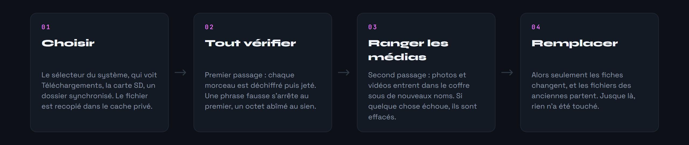
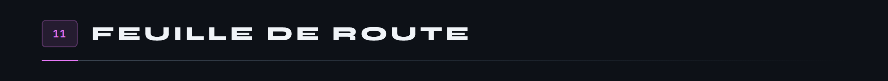
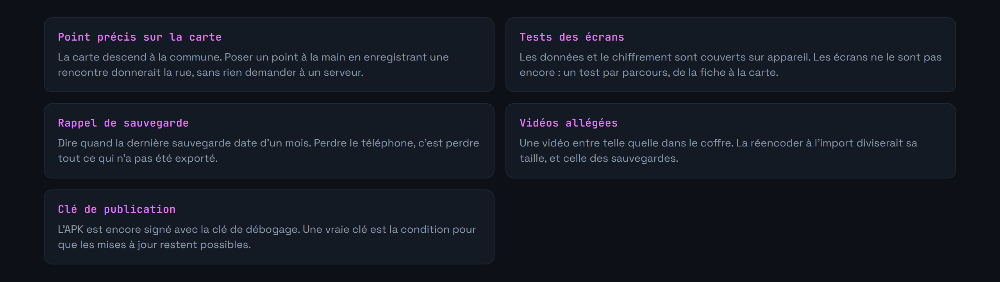
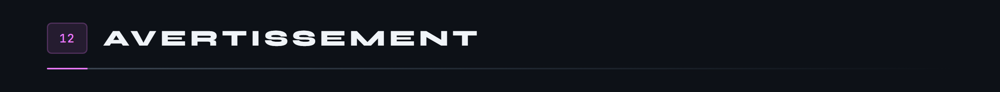

<div align="center">

<p>
  
  <a href="README.en.md"></a>
</p>


</div>

**Journal personnel chiffré, hors ligne, sur Android.**

> **Projet en cours.** L'application tourne sur un appareil réel, tous les écrans sont là, la sauvegarde se restaure et dix-huit tests tournent sur émulateur. La feuille de route est plus bas.

Une application de suivi personnel qui ne parle à aucun serveur. Tout vit dans un SQLite chiffré sur le téléphone, derrière une empreinte qui ne déverrouille pas un écran mais la clé elle même, et n'en sort que si on demande explicitement une sauvegarde, chiffrée elle aussi.

Le projet m'intéressait surtout pour la contrainte : construire quelque chose d'utile sur des données sensibles **sans** backend, sans compte, sans télémétrie. Toute la conception découle de là, y compris la carte, qui dessine la France et ses communes à partir de données embarquées plutôt que d'aller chercher des tuiles.


Ces quatre là ne montrent aucun visage, et c'est la raison pour laquelle ce sont ceux qui sont ici : le jeu d'essai du dépôt est fait de portraits qui n'ont rien à faire dans une page publique. Ils sont d'ailleurs les seuls fichiers du projet à rester hors du dépôt.


Nécessite le SDK Flutter 3.x et un appareil ou un émulateur Android. Le projet suit le modèle de Flutter 3.47 : Gradle 9.3, le plugin Android 9.1 et Kotlin 2.4, compilé par le plugin Android lui-même.

```bash
git clone https://github.com/Cybertrist/BodyCount.git
cd BodyCount
flutter pub get
flutter run
```

Pour une version installable, `flutter build apk --release --split-per-abi`. Le découpage par architecture n'est pas de la coquetterie : SQLCipher embarque une bibliothèque native par ABI, et sans lui l'APK pèse un tiers de plus pour rien.

Deux paquets ont été remplacés par quelques lignes de Kotlin dans `MainActivity`. `cryptography_flutter` s'installait comme implémentation de toute la cryptographie, dérivation de clé comprise, et Android refusait la clé HMAC vide d'une extraction sans sel : la base ne s'ouvrait plus. `share_plus` 13 aurait exigé une version majeure de `flutter_secure_storage`, là où vit la clé maîtresse. L'activité porte donc l'AES-GCM natif, le sélecteur de fichiers, le partage, et la lecture de la durée et d'une image d'une vidéo.


Cinq couches, et une règle : une couche ne connaît jamais celle du dessus. Un écran ne voit pas SQLite, un dépôt ne voit pas Riverpod, et rien ne lit un fichier du coffre sans passer par le trousseau.


Au déverrouillage, le répertoire, les villes et les statistiques demandent la base au même instant. La base garde le futur de son ouverture, et tous l'attendent. Ce n'était pas le cas : chacun lançait la sienne, l'une fermait la connexion de l'autre en vérifiant la clé, et l'autre, croyant la base en clair, la recopiait en effaçant le fichier. L'application tournait ensuite sur deux fichiers, la fiche écrivait dans l'un et le répertoire lisait l'autre, ce qui se voyait comme une ville qui refusait de changer. Une base n'est plus jugée en clair que sur son en-tête, et celle qui aurait perdu son numéro de version dans l'affaire se répare au lancement.



Six tables, schéma v7. `personnes` est le pivot : tout ce qui s'y rattache part avec elle, et c'est le schéma qui le garantit, pas une boucle de suppression écrite à la main. Les vidéos vivent dans la table des photos, avec un type, une durée et une vignette : elles sont au même endroit de la fiche, partent avec elle et se rangent dans le même coffre.


L'empreinte ne déverrouille pas un écran : elle charge la clé maîtresse depuis le Keystore. Tant qu'elle n'a pas été donnée, la base est un fichier illisible, les photos et les vidéos aussi. Deux clés en sont dérivées par HKDF, l'une pour SQLCipher, l'autre pour le coffre, et aucune n'existe en mémoire avant.


Chaque photo est un fichier à part, chiffré en AES-GCM d'un seul bloc, nommé par un UUID qui ne dit rien de son contenu. Une vidéo suit le même principe, en morceaux : la section suivante dit pourquoi. Une sauvegarde exportée utilise le même flux par morceaux, mais sa clé vient de ta phrase de passe plutôt que du Keystore : sans elle, le fichier ne se relit nulle part, y compris sur le téléphone qui l'a produit.


Le verrou se referme sans geste à l'écran, ou au retour d'arrière-plan, après un délai réglable. Il attend la fin d'un travail en cours : une sauvegarde, une restauration ou une longue vidéo qui se chiffre ne se touchent pas du doigt, et le sélecteur de fichiers du système passe l'application en arrière-plan. Il se coupe aussi entièrement dans les réglages : le chiffrement reste, mais la clé se charge alors sans preuve d'identité, et l'écran le dit avant de l'accepter. Au verrouillage, les clés sont oubliées, et leurs octets écrasés avant d'être lâchés plutôt que laissés au ramasse-miettes. L'aperçu du multitâche est masqué, les captures d'écran bloquées, et la sauvegarde automatique d'Android refusée : elle recopierait la base chiffrée sur des serveurs qui ne sont pas les tiens.


Une vidéo pèse cent fois une photo. La chiffrer d'un bloc demandait de la tenir entière en mémoire, et une sauvegarde qui l'emportait devait tenir en mémoire toutes les vidéos à la fois. Les deux passent donc par un flux chiffré par morceaux d'un mégaoctet, écrit et relu sur le disque.



Chaque morceau authentifie son rang et le fait d'être le dernier, sans les écrire : ils entrent dans le calcul de l'étiquette. Intervertir deux morceaux, en retirer un ou couper la fin du fichier fait échouer la lecture au lieu de rendre une vidéo amputée sans rien dire. L'AES passe par le chiffrement d'Android, qui utilise les instructions du processeur : en Dart pur, cent mégaoctets prenaient une demi-minute.

Pour être lue, une vidéo est déchiffrée dans le cache privé de l'application, parce que le lecteur du système a besoin d'un fichier. La copie est effacée à la fermeture du lecteur, au verrouillage, et au lancement suivant si l'application a été tuée en pleine lecture. La vignette et la durée sont lues par Android au moment de l'import, sur le fichier encore en clair, puis la vignette entre au coffre comme une photo.

Une restauration ne touche à rien avant d'avoir tout vérifié. Le fichier est lu deux fois : la première pour déchiffrer chaque morceau et le jeter, la seconde pour ranger les médias sous de nouveaux noms. Une phrase fausse s'arrête au premier morceau, un octet abîmé au sien, et dans les deux cas les fiches du téléphone sont intactes.



L'export propose d'enregistrer le fichier dans un dossier avant de le partager : avec des vidéos, une sauvegarde dépasse vite ce que la plupart des applications acceptent. Le partage passe par une URI temporaire limitée au seul dossier des sauvegardes. Les sauvegardes faites avant, en ZIP chiffré d'un bloc, se relisent toujours.


Une carte à tuiles enverrait à un serveur, à chaque déplacement du doigt, la liste exacte des endroits regardés. Pour une application dont toute la promesse est que rien ne sort du téléphone, c'était la seule chose à ne pas faire. La France est donc embarquée.


La carte se pince pour zoomer jusqu'à vingt fois, se traîne pour se déplacer, et la règle se regradue toute seule. Elle s'ouvre cadrée sur les villes qui font les deux tiers des rencontres, donc sur le vrai cœur d'activité plutôt que sur le pays entier.

Aucune pastille n'est déplacée d'un pixel : à l'échelle d'un pays, écarter un point de quarante points le déplace de cent kilomètres. Quand deux villes sont trop proches pour tenir côte à côte, elles se réunissent en une bulle qui porte la somme, et qui se scinde dès qu'on s'approche assez. Vannes et Auray sont à dix-sept kilomètres : aucun placement malin n'y change quoi que ce soit, c'est de la géographie.

À fort grossissement, seuls les contours qui touchent la fenêtre sont dessinés. Payer les quarante-cinq mille points à chaque image faisait tomber l'affichage à quelques images par seconde, et le halo de côte, qui était un flou de masque, obligeait le moteur à rendre le pays dans une couche à part avant de la flouter.

Les villes viennent du référentiel officiel des communes, embarqué lui aussi : les 34 836 communes de métropole et de Corse, du plus petit village à Paris, 420 Ko une fois compressées dans l'APK. `tool/communes.mjs` le reconstruit depuis geo.api.gouv.fr ; c'est le seul endroit du projet qui touche au réseau, et il tourne sur la machine du développeur, pas sur le téléphone.



Tout ce qui est en France est posé. Le nom exact d'abord, en ignorant accents, tirets et « St » ; puis un début de nom, « Plougastel » pour Plougastel-Daoulas ; puis une faute d'une ou deux lettres ; puis un nom de commune suivi d'un quartier. À chaque étape la plus peuplée l'emporte, et un département entre parenthèses, « Saint-Denis (11) », départage les homonymes. La tolérance s'arrête aux villes : « chez lui » n'est pas un village à une lettre près, et un lieu de rencontre qui n'est pas une ville compte pour la ville de la fiche. L'étranger reste hors de la carte, qui ne dessine que la France, mais figure dans le classement des lieux.


L'écran s'appelait « Frise », et c'en était une : une seule longue liste, du plus récent au plus ancien. Elle répondait à « c'était quand » à condition de défiler jusqu'à la bonne date, ce qui devient absurde passé quelques dizaines d'entrées.

Un mois tient sur sept colonnes. Les soirs pleins, les semaines vides et les séries se lisent d'un coup, sans compter. Un jour vide n'est qu'un chiffre effacé ; un jour plein porte un disque, doré quand la soirée a rapporté. On tape dessus pour n'avoir que lui dans la liste en dessous.

Sous chaque jour, jusqu'à trois signes disent ce qu'il a eu de remarquable, du plus rare au plus banal : le meilleur montant de l'année avant les cent euros, les cent euros avant un simple billet, la meilleure note du mois avant un cinq sur cinq. Vingt-cinq signes en tout, tous déduits de ce que l'application enregistre déjà, aucun à saisir en plus. Une légende accessible depuis l'en-tête dit précisément ce qui déclenche chacun : pas « une bonne soirée » mais « une note de cinq sur cinq », pour qu'on sache quoi saisir si on veut le voir apparaître.

Toujours six semaines affichées, même quand le mois n'en occupe que cinq : une grille dont la hauteur dépend du mois fait sauter tout l'écran quand on le feuillette.


Ce qui se casse sans bruit est ce qui touche au disque : l'ouverture de la base, ses migrations, le chiffrement, la sauvegarde. Or SQLCipher, le Keystore et l'AES natif n'existent que sur Android. Les tests tournent donc sur un émulateur, avec les vraies bibliothèques, et non contre des imitations qui passeraient là où l'application échoue.

```bash
flutter test integration_test -d emulator-5554
```

Ils détruisent les données et la clé de l'application qu'ils visent : à lancer sur un émulateur, jamais sur le téléphone qui porte le vrai journal.


Ils ont servi dès leur première exécution : la marque de fin d'une sauvegarde s'écrivait sur onze octets et se lisait sur un, et aucune restauration n'aurait abouti. Le premier essai de l'application sur émulateur avait, lui, trouvé la fausse conversion de la base, en montrant « table already exists » au lieu du répertoire.







Ce dépôt est un projet personnel, pas un produit de sécurité. Le chiffrement s'appuie sur des primitives éprouvées et sur le Keystore d'Android, mais l'assemblage, lui, n'a été relu par personne d'autre que moi. Si tu comptes y mettre des données dont la fuite te coûterait quelque chose, lis le code avant, ou ne le fais pas.

Le jeu d'essai attend ses visages dans `assets/demo/`, qui ne fait pas partie du dépôt. Sans eux les dix-huit fiches se créent quand même, simplement sans photo : le générateur se passe de chaque image absente.

---

<sub>Les images de cette page ne sortent d'aucun logiciel de dessin : ce sont des pages HTML que Chrome capture, et quatre SVG animés. Les scripts sont dans <a href="docs/tools/">docs/tools</a>, et <code>bash docs/tools/tout.sh</code> les refait toutes, dans les deux langues.</sub>
