<div align="center">

<p>
  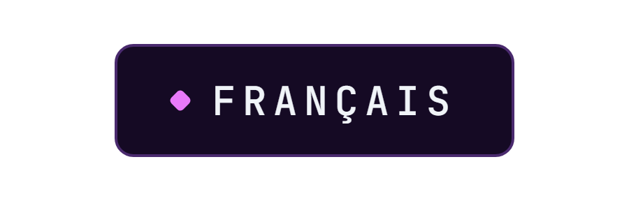
  <a href="README.en.md"></a>
</p>


<br><br>

</div>

Je voulais un endroit où garder ce qui entoure mes rencontres : une photo, quelques notes sur la personne, un avis sur la soirée, des étiquettes pour m'en souvenir, une adresse, ce que ça a rapporté parfois. Des informations très sensibles, qui n'ont rien à faire dans les contacts du téléphone ni dans une application qui les enverrait sur un serveur, et qu'on veut pourtant retrouver en deux secondes, classées proprement, avec des statistiques qui en tirent quelque chose.

Rien de ce qui existait ne faisait les deux : garder tout ça bien rangé, et le garder pour soi. BodyCount est né de là. Tout vit dans une base chiffrée sur le téléphone, derrière une empreinte qui ne déverrouille pas un écran mais la clé elle même. Pas de serveur, pas de compte, pas de télémétrie : rien ne sort, sauf une sauvegarde qu'on demande explicitement, chiffrée elle aussi par une phrase de passe.

Toute la conception découle de cette contrainte, jusqu'à la carte, qui dessine la France et ses 34 836 communes à partir de données embarquées plutôt que d'aller chercher des tuiles sur internet.

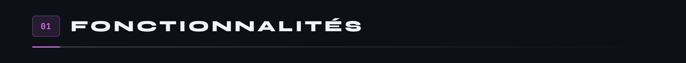


L'application est pensée d'abord pour le format passeport, l'écran de couverture d'un Galaxy Z Fold : large et court. C'est là qu'elle sert tous les jours, et c'est lui qui porte la planche complète. Les visages sont ceux du jeu d'essai, des portraits générés : personne de réel.


Au lancement, Android pose l'icône au centre ; l'application la reprend au même endroit, trace un anneau autour, fait monter son nom, puis fait glisser le logo et le titre jusqu'à leur place exacte sur l'écran d'ouverture. On ne voit pas où l'un s'arrête et où l'autre commence. La demande d'empreinte n'arrive qu'une fois l'animation terminée.

Sur un téléphone classique en 16/9, la mise en page passe à deux colonnes et range la recherche sous le titre :

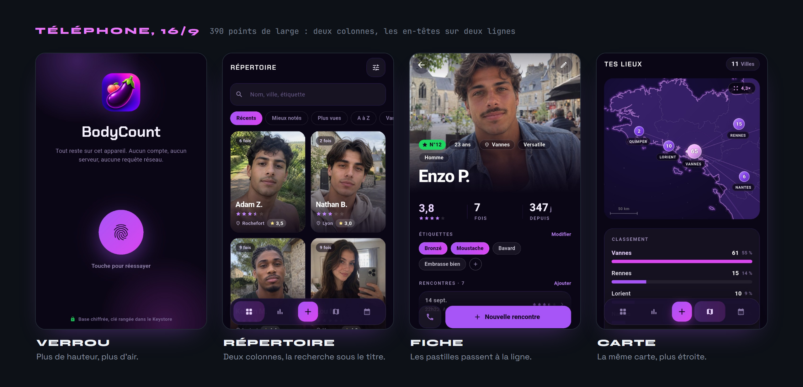

Et sur l'écran déplié, en 4/3, la navigation devient un rail à gauche et le répertoire passe à quatre colonnes :

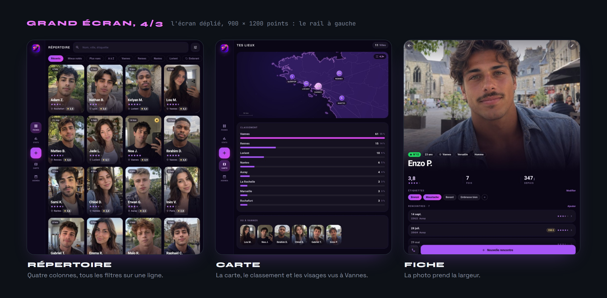

Le même écran couché passe à 1200 points de large. La fiche se partage alors en deux volets, la photo à gauche sur toute la hauteur :

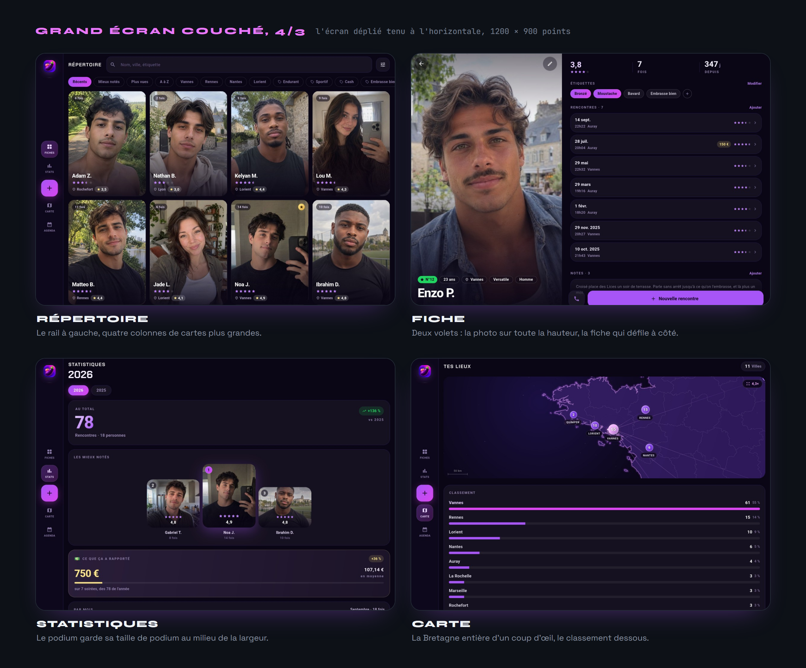

Le répertoire se filtre pendant qu'on tape : chaque lettre refait une seule requête sur la base chiffrée, qui cherche dans le prénom, la ville et les étiquettes. Les pastilles de ville et d'étiquette s'ajoutent à la recherche au lieu de la remplacer, et un tri ne change que l'ordre de cette même requête.


Noter une rencontre prend six champs, tous facultatifs sauf la date, déjà réglée à maintenant. La note se donne par demi-point en touchant la moitié d'une étoile, et un montant laissé vide veut dire rien, pas une fois à zéro euro. À l'enregistrement, une seule fonction, `rafraichir()`, fait relire la fiche, le rang, le répertoire, les statistiques, le calendrier et la carte : aucun écran ne garde un chiffre périmé.


Chaque chiffre de l'écran des statistiques sort d'une requête SQL, pas d'une boucle dans l'appli : la base renvoie douze entiers pour les douze barres, pas toutes les rencontres. La moyenne de ce que ça a rapporté ne compte que les soirées payées, et une année sans précédent n'affiche pas de pourcentage plutôt que de diviser par zéro. Le total, les gains et les mois suivent l'année choisie ; le podium et les rôles portent sur toutes les fiches.


La palette reprend le dégradé du logo, du violet au fuchsia, sur des fonds presque noirs.

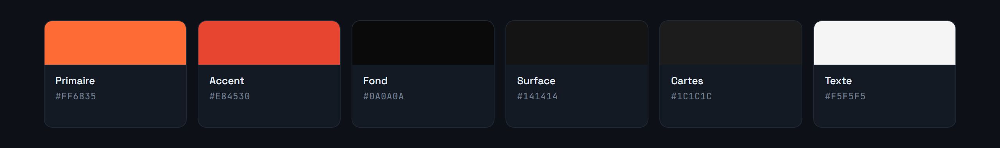

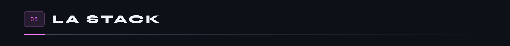

L'APK se trouve dans les [Releases](https://github.com/Cybertrist/BodyCount/releases/latest) du dépôt, et non dans le code : un binaire de près de trente mégaoctets versionné avec les sources resterait dans l'historique pour toujours, et chaque clone le traînerait, une fois par version. Le lien ci-dessous mène toujours à la dernière.

<p align="center">
  <a href="https://github.com/Cybertrist/BodyCount/releases/latest/download/BodyCount.apk">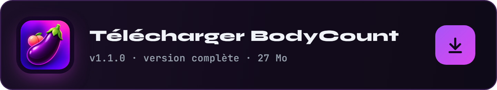</a>
</p>

Il demande Android 7 ou plus sur un processeur 64 bits, soit tout téléphone de ces dernières années. Comme il ne passe pas par le Play Store, Android fera autoriser l'installation depuis l'application qui l'ouvre, le navigateur ou le gestionnaire de fichiers.

Pour une application qui gardera ce genre de données, deux vérifications valent la minute qu'elles prennent. L'empreinte du fichier doit être celle publiée avec la version :

```bash
sha256sum BodyCount.apk
```

Et le certificat qui le signe doit être celui-ci, le même pour toutes les versions. Android refuse une mise à jour signée d'une autre clé, ce qui écarte aussi un APK retouché en chemin :

```bash
apksigner verify --print-certs BodyCount.apk
# SHA-256 : ac09674e066658991aeb60f02e1386423b5e14dede4bd6c844f542785fef86d1
```

L'APK publié ne contient pas le jeu d'essai : ni les dix-huit profils, ni leurs visages, ni la ligne des réglages qui les crée.


Nécessite le SDK Flutter 3.x et un appareil ou un émulateur Android. Le projet suit le modèle de Flutter 3.47 : Gradle 9.3, le plugin Android 9.1 et Kotlin 2.4, compilé par le plugin Android lui-même.

```bash
git clone https://github.com/Cybertrist/BodyCount.git
cd BodyCount
flutter pub get
flutter run
```

Pour une version installable, `flutter build apk --release --split-per-abi`. Le découpage par architecture n'est pas de la coquetterie : SQLCipher embarque une bibliothèque native par ABI, et sans lui l'APK pèse un tiers de plus pour rien. La version de publication est signée par la clé que désigne `android/key.properties`, ignoré par git ; sans ce fichier, c'est la clé de débogage.

Quelques lignes de Kotlin dans `MainActivity` remplacent deux paquets. `cryptography_flutter` s'installait comme implémentation de toute la cryptographie, dérivation de clé comprise, et Android refusait la clé HMAC vide d'une extraction sans sel : la base ne s'ouvrait plus. `share_plus` 13 aurait exigé une version majeure de `flutter_secure_storage`, là où vit la clé maîtresse. L'activité porte donc l'AES-GCM natif, le sélecteur de fichiers, le partage, l'enregistrement dans la galerie, la lecture de la durée et d'une image d'une vidéo, et son réencodage par Media3.

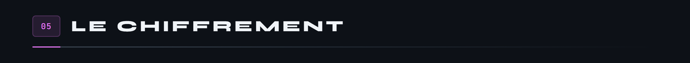

Cinq couches, et une règle : une couche ne connaît jamais celle du dessus. Un écran ne voit pas SQLite, un dépôt ne voit pas Riverpod, et rien ne lit un fichier du coffre sans passer par le trousseau.

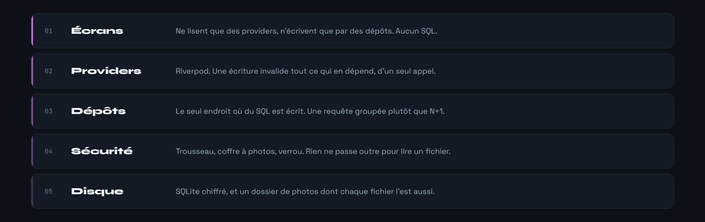

Au déverrouillage, le répertoire, les villes et les statistiques demandent la base au même instant. La base garde le futur de son ouverture, et tous l'attendent. Ce n'était pas le cas au départ : chacun lançait la sienne, l'une fermait la connexion de l'autre en vérifiant la clé, et l'autre, croyant la base en clair, la recopiait en effaçant le fichier. L'application tournait ensuite sur deux fichiers, la fiche écrivait dans l'un et le répertoire lisait l'autre, ce qui se voyait comme une ville qui refusait de changer. Une base n'est plus jugée en clair que sur son en-tête, et celle qui aurait perdu son numéro de version dans l'affaire se répare au lancement.


Six tables, schéma v7. `personnes` est le pivot : tout ce qui s'y rattache part avec elle, et c'est le schéma qui le garantit, pas une boucle de suppression écrite à la main. Les vidéos vivent dans la table des photos, avec un type, une durée et une vignette : elles sont au même endroit de la fiche, partent avec elle et se rangent dans le même coffre.


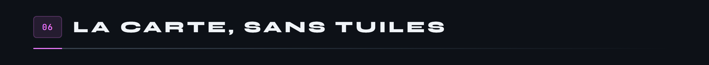

L'empreinte ne déverrouille pas un écran : c'est elle qui fait entrer la clé maîtresse en mémoire. Cette clé de 32 octets, tirée au hasard au premier lancement, dort dans des préférences chiffrées par le Keystore d'Android ; tant qu'Android n'a pas reconnu ton doigt ou ton code, la base, les photos et les vidéos ne sont que du bruit sur le disque. Deux clés en sont dérivées par HKDF, chacune par sa propre étiquette, l'une pour SQLCipher, l'autre pour le coffre, et aucune n'existe en mémoire avant.


Chaque photo est un fichier à part, chiffré en AES-GCM d'un seul bloc, nommé par un UUID qui ne dit rien de son contenu. Une vidéo suit le même principe, en morceaux : la section suivante dit pourquoi. Une sauvegarde exportée utilise le même flux par morceaux, mais sa clé vient de ta phrase de passe plutôt que du Keystore : sans elle, le fichier ne se relit nulle part, y compris sur le téléphone qui l'a produit.


Le verrou se referme sans geste à l'écran, ou au retour d'arrière-plan, après un délai réglable. Il attend la fin d'un travail en cours : une sauvegarde, une restauration ou une longue vidéo qui se chiffre ne se touchent pas du doigt, et le sélecteur de fichiers du système passe l'application en arrière-plan. Il se coupe aussi entièrement dans les réglages : le chiffrement reste, mais la clé se charge alors sans preuve d'identité, et l'écran le dit avant de l'accepter. Au verrouillage, les clés sont oubliées, et leurs octets écrasés avant d'être lâchés plutôt que laissés au ramasse-miettes. L'aperçu du multitâche est masqué, les captures d'écran bloquées, et la sauvegarde automatique d'Android refusée : elle recopierait la base chiffrée sur des serveurs qui ne sont pas les tiens.


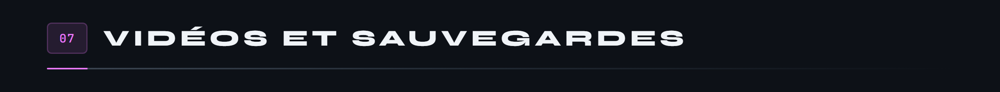

Une photo ou une vidéo n'entre jamais en clair dans BodyCount. La copie que rend le sélecteur d'Android est chiffrée dans le coffre de l'application, puis effacée, et rien n'apparaît dans la galerie du téléphone. Pour l'afficher, la photo est déchiffrée en mémoire et la vidéo dans le cache privé, le temps de la lecture. Seul le bouton de téléchargement en pose une copie en clair dans la galerie, et seulement si tu le demandes.


Une vidéo pèse cent fois une photo. La chiffrer d'un bloc demandait de la tenir entière en mémoire, et une sauvegarde qui l'emportait devait tenir en mémoire toutes les vidéos à la fois. Les deux passent donc par un flux chiffré par morceaux d'un mégaoctet, écrit et relu sur le disque.


Chaque morceau authentifie son rang et le fait d'être le dernier, sans les écrire : ils entrent dans le calcul de l'étiquette. Intervertir deux morceaux, en retirer un ou couper la fin du fichier fait échouer la lecture au lieu de rendre une vidéo amputée sans rien dire. L'AES passe par le chiffrement d'Android, qui utilise les instructions du processeur : en Dart pur, cent mégaoctets prenaient une demi-minute.

Un téléphone filme en 1080p ou en 4K à des débits pensés pour un grand écran. À l'import, une vidéo lourde est réencodée par Media3 sur l'encodeur du téléphone : H.264, 720 points sur le petit côté, 2,5 Mb/s, le son tel quel. Une vidéo de 20 Mo en pèse environ 3. Réencoder dégrade toujours un peu : une vidéo déjà légère n'est pas touchée, et la version allégée n'est gardée que si elle gagne au moins un dixième. Si l'encodeur échoue, c'est l'original qui entre au coffre.


Pour être lue, une vidéo est déchiffrée dans le cache privé de l'application, parce que le lecteur du système a besoin d'un fichier. La copie est effacée à la fermeture du lecteur, au verrouillage, et au lancement suivant si l'application a été tuée en pleine lecture. Un bouton de la visionneuse range une photo ou une vidéo dans la galerie du téléphone, sous Images ou Films, dossier BodyCount : en clair, puisque c'est tout l'objet du geste, et le message le rappelle.

Une sauvegarde est chiffrée par une phrase de passe, pas par la clé du téléphone : elle se relit donc sur un autre appareil. La phrase passe par PBKDF2 en 210 000 tours, puis le fichier s'écrit en flux, les fiches d'abord, puis chaque photo et chaque vidéo, sorties du coffre et rechiffrées aussitôt, sans jamais toucher le disque en clair. Une fois le fichier posé où tu veux, la date est notée et le rappel du répertoire se tait pendant un mois.


Une restauration ne touche à rien avant d'avoir tout vérifié. Le fichier est lu deux fois : la première pour déchiffrer chaque morceau et le jeter, la seconde pour ranger les médias sous de nouveaux noms, à côté des anciens. Les fiches ne sont remplacées qu'à la toute fin. Une phrase fausse s'arrête au premier morceau, un octet abîmé au sien, et une coupure en route n'efface que les fichiers qu'elle venait d'ajouter : dans tous les cas, les fiches du téléphone sont intactes.


L'export propose d'enregistrer le fichier dans un dossier avant de le partager : avec des vidéos, une sauvegarde dépasse vite ce que la plupart des applications acceptent. Le partage passe par une URI temporaire limitée au seul dossier des sauvegardes. Quand la dernière sauvegarde a plus d'un mois, ou qu'il n'y en a jamais eu, un bandeau le dit en haut du répertoire. Les sauvegardes de l'ancien format, un ZIP chiffré d'un bloc, se relisent toujours.

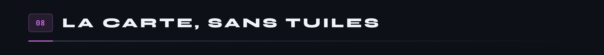

Une carte à tuiles enverrait à un serveur, à chaque déplacement du doigt, la liste exacte des endroits regardés. Pour une application dont toute la promesse est que rien ne sort du téléphone, c'était la seule chose à ne pas faire. La France est donc embarquée.

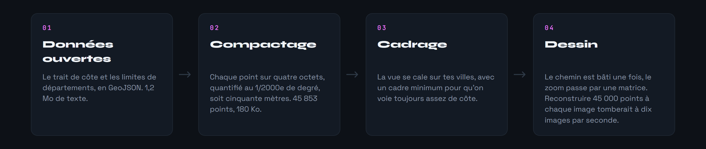

La carte s'ouvre serrée sur tes villes, pas sur toutes : on part de la principale et on s'élargit jusqu'aux deux tiers des rencontres. Deux villes trop proches pour tenir côte à côte deviennent une seule bulle, qui porte la somme ; les disques ne bougent jamais, c'est en s'approchant qu'elles se séparent.


La carte se pince pour zoomer jusqu'à vingt fois, se traîne pour se déplacer, et la règle se regradue toute seule. Elle s'ouvre cadrée sur les villes qui font les deux tiers des rencontres, donc sur le vrai cœur d'activité plutôt que sur le pays entier.

Aucune pastille n'est déplacée d'un pixel : à l'échelle d'un pays, écarter un point de quarante points le déplace de cent kilomètres. Quand deux villes sont trop proches pour tenir côte à côte, elles se réunissent en une bulle qui porte la somme, et qui se scinde dès qu'on s'approche assez. Vannes et Auray sont à dix-sept kilomètres : aucun placement malin n'y change quoi que ce soit, c'est de la géographie.

Les villes viennent du référentiel officiel des communes, embarqué lui aussi : les 34 836 communes de métropole et de Corse, du plus petit village à Paris, 420 Ko une fois compressées dans l'APK. `tool/communes.mjs` le reconstruit depuis geo.api.gouv.fr ; c'est le seul endroit du projet qui touche au réseau, et il tourne sur la machine du développeur, pas sur le téléphone. Le point précis s'ouvre déjà centré sur la commune où tombe le lieu tapé.


Tout ce qui est en France est posé. Le nom exact d'abord, en ignorant accents, tirets et « St » ; puis un début de nom, « Plougastel » pour Plougastel-Daoulas ; puis une faute d'une ou deux lettres ; puis un nom de commune suivi d'un quartier. À chaque étape la plus peuplée l'emporte, et un département entre parenthèses, « Saint-Denis (11) », départage les homonymes. La tolérance s'arrête aux villes : « chez lui » n'est pas un village à une lettre près, et un lieu de rencontre qui n'est pas une ville compte pour la ville de la fiche. L'étranger reste hors de la carte, qui ne dessine que la France, mais figure dans le classement des lieux.

Une rencontre peut aussi se poser à la main, à un point précis. Sans tuiles, il n'y a pas de rues à montrer : ce sont les communes voisines, avec leur nom, qui servent de repère. De quoi poser un point « entre Arradon et Séné », qui apparaît sur la carte des lieux une fois qu'on s'est approché.

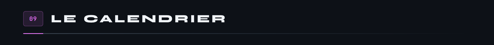

La question qu'on se pose le plus souvent n'est pas « combien », mais « quand » : c'était quel soir, il y a combien de temps, est-ce que ça a été une bonne période. Une liste chronologique y répond mal passé quelques dizaines d'entrées : il faut défiler et compter.

Le calendrier y répond d'un coup d'œil. Un mois tient sur sept colonnes : les soirs pleins, les semaines vides et les séries se lisent sans compter. Un jour vide n'est qu'un chiffre effacé ; un jour plein porte un disque, doré quand la soirée a rapporté. On tape dessus pour n'avoir que lui dans la liste en dessous.

Sous chaque jour, jusqu'à trois signes disent ce qu'il a eu de remarquable, du plus rare au plus banal : le meilleur montant de l'année avant les cent euros, les cent euros avant un simple billet, la meilleure note du mois avant un cinq sur cinq. Vingt-cinq signes en tout, tous déduits de ce que l'application enregistre déjà, aucun à saisir en plus. Une légende accessible depuis l'en-tête dit précisément ce qui déclenche chacun : pas « une bonne soirée » mais « une note de cinq sur cinq », pour qu'on sache quoi saisir si on veut le voir apparaître.


Un jour peut mériter bien plus de trois signes : le 23 en a six. Ils passent au tri, du plus rare au plus banal, et seuls les trois premiers tiennent sous le disque, les deux premiers sur la ligne de la liste. Le reste n'est pas perdu, il n'a simplement pas la place.

Toujours six semaines affichées, même quand le mois n'en occupe que cinq : une grille dont la hauteur dépend du mois fait sauter tout l'écran quand on le feuillette.

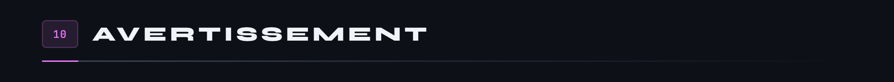


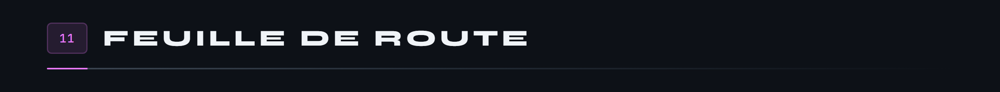

Ce qui se casse sans bruit est ce qui touche au disque : l'ouverture de la base, ses migrations, le chiffrement, la sauvegarde. Or SQLCipher, le Keystore et l'AES natif n'existent que sur Android. Les tests tournent donc sur un émulateur, avec les vraies bibliothèques, et non contre des imitations qui passeraient là où l'application échoue. Six d'entre eux pilotent l'application entière, au doigt, d'un écran à l'autre.

```bash
flutter test integration_test -d emulator-5554
```

Ils détruisent les données et la clé de l'application qu'ils visent : à lancer sur un émulateur, jamais sur le téléphone qui porte le vrai journal.


Ils ont servi dès leur première exécution. Ceux des données ont trouvé une marque de fin de sauvegarde écrite sur onze octets et lue sur un : aucune restauration n'aurait abouti. Ceux des écrans ont trouvé une rangée de chiffres qui débordait de sa hauteur fixe sur la fiche.

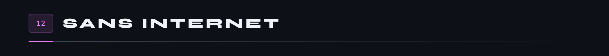

« Aucune requête réseau » s'écrit facilement. Ici, ce n'est pas une promesse du code mais une règle d'Android : l'application ne demande pas la permission `INTERNET`, et sans elle le système refuse d'ouvrir la moindre connexion. Un bug, une bibliothèque trop bavarde, une dépendance piégée à la prochaine mise à jour : tout se heurte au même mur, qui n'est pas dans l'application et qu'elle ne peut pas franchir.

Ça se vérifie sur l'APK lui-même, sans lire une ligne de code :

```bash
aapt2 dump permissions app-arm64-v8a-release.apk
```

La liste est courte : l'empreinte, sous son nom actuel et son ancien, puis `WAKE_LOCK` et `ACCESS_NETWORK_STATE`, qu'ajoutent des bibliothèques. La première empêche le téléphone de s'endormir en plein travail, la seconde dit si le réseau est là, sans permettre de s'en servir.

Restent quatre sorties, et aucune ne s'ouvre seule. Chacune attend un doigt, et passe la main à une autre application, qui répond ensuite de ce qu'elle en fait :


La dernière est la seule à laisser une trace en clair : une photo téléchargée devient une photo comme les autres, visible de la galerie et de tout ce qui la lit. C'est le prix de « je veux la garder ailleurs », et l'application ne le paie qu'à la demande.


Ce dépôt est un projet personnel, pas un produit de sécurité. Le chiffrement s'appuie sur des primitives éprouvées et sur le Keystore d'Android, mais l'assemblage, lui, n'a été relu par personne d'autre que moi. Si tu comptes y mettre des données dont la fuite te coûterait quelque chose, lis le code avant, ou ne le fais pas.

Le jeu d'essai n'existe que dans une version de travail, compilée avec `--dart-define=ESSAIS=true`. Ses visages ne font pas partie du dépôt : ils se posent sur le téléphone, dans le dossier propre à l'application, avec `adb push assets/demo/. /sdcard/Android/data/com.bodycount.bodycount/files/demo/`. Sans eux les dix-huit fiches se créent quand même, simplement sans photo : le générateur se passe de chaque image absente.

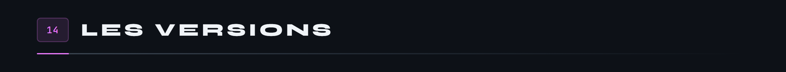

BodyCount est conçu et développé par **Tristan Joncour** ([@Cybertrist](https://github.com/Cybertrist)), élève ingénieur en cyberdéfense à l'ENSIBS, pour son propre usage d'abord : c'est l'application qu'il voulait avoir sur son téléphone, et qui n'existait pas.

Le code est publié sous licence [MIT](LICENSE) : libre de le lire, de le reprendre et de le modifier, à condition de garder la mention de copyright. La géométrie de la France et le référentiel des communes viennent de données ouvertes ; la police Chakra Petch est sous licence SIL Open Font ; l'icône d'empreinte des schémas vient de Material Design, sous licence Apache 2.0.

---

<sub>Les images de cette page ne sortent d'aucun logiciel de dessin : ce sont des pages HTML que Chrome capture, et six SVG animés. Les captures d'écran viennent d'un émulateur piloté par script, rognées de leurs barres par <code>rogner.js</code>. Tout est dans <a href="docs/tools/">docs/tools</a>, et <code>bash docs/tools/tout.sh</code> refait tout, dans les deux langues, aperçu social compris.</sub>
